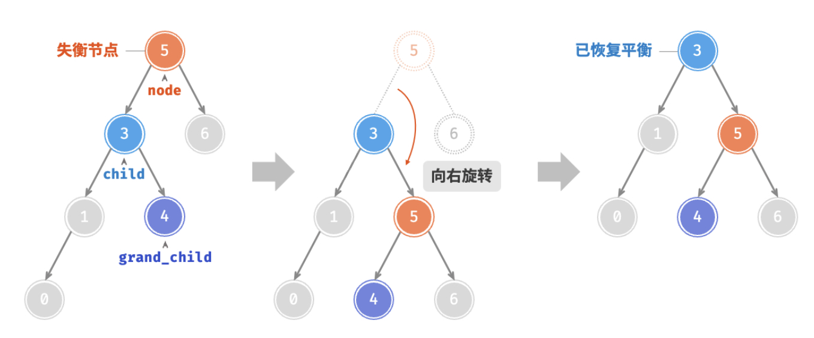
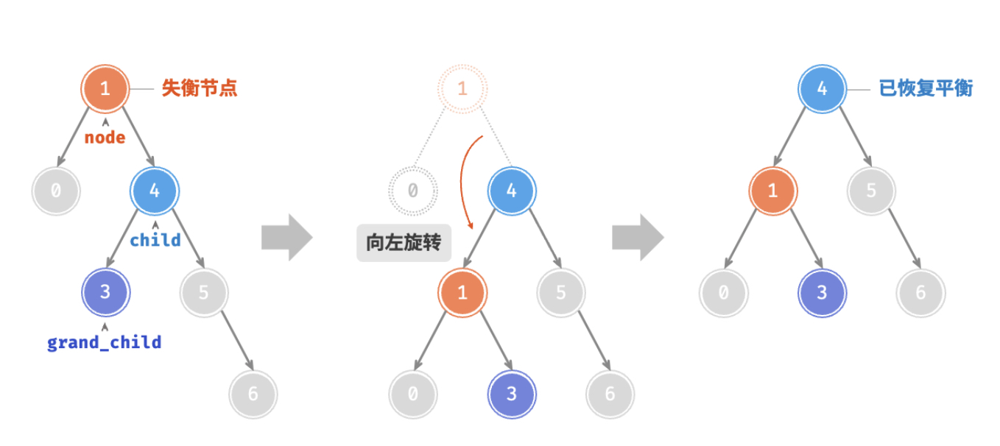
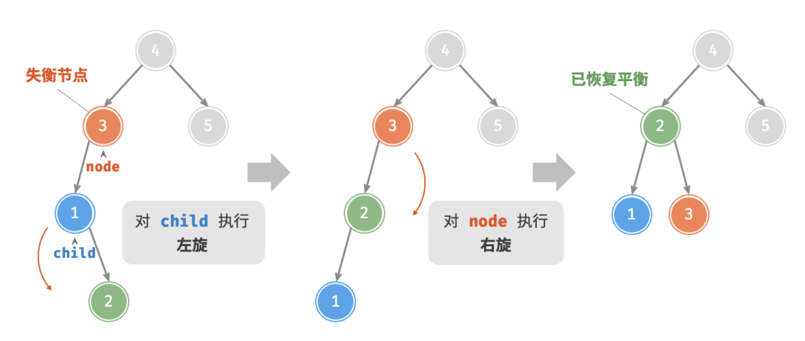
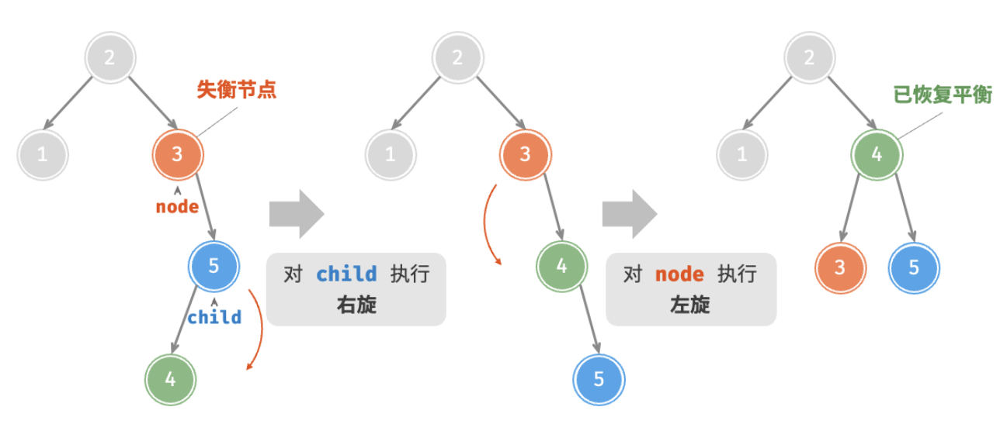
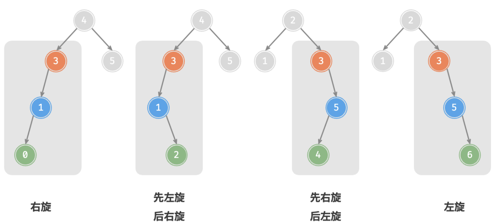
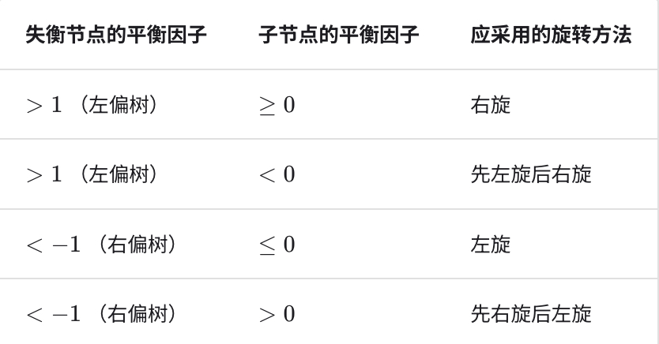

<!-- TOC -->

* [二叉平衡树 AVL](#二叉平衡树-avl)
* [树节点定义](#树节点定义)
* [树高度](#树高度)
* [平衡因子](#平衡因子)
* [树的旋转](#树的旋转)
    * [右旋 RightRotate](#右旋-rightrotate)
    * [左旋 LeftRotate](#左旋-leftrotate)
    * [先左旋后右旋](#先左旋后右旋)
    * [先右旋再左旋](#先右旋再左旋)
    * [AVL 旋转策略](#avl-旋转策略)
* [插入节点](#插入节点)
    * [递归法](#递归法)
    * [递归法](#递归法-1)
* [删除节点](#删除节点)
    * [递归法](#递归法-2)
    * [迭代法](#迭代法)
        * [单栈（错误代码）](#单栈错误代码)
        * [双栈（可行方案）](#双栈可行方案)
        * [单栈（修改版）](#单栈修改版)
* [查找节点](#查找节点)
* [单元测试](#单元测试)
* [Algorithm 4th 实现源码](#algorithm-4th-实现源码)
* [Reference](#reference)

<!-- TOC -->

# 二叉平衡树 AVL

# 树节点定义

树节点结构：

- 节点的值 int
- 左右子树节点
- 树的高度（需要计算左右子树相对高度，决定是否平衡）
    - “节点高度”是指从**该节点到它的最远叶节点的距离**，即所经过的“边”的数量。需要特别注意的是，叶节点的高度为 0，而空节点的高度为
      -1

```java
public class TreeNode {
    int val;
    TreeNode left, right;
    int height;

    public TreeNode(int val) {
        this.val = val;
    }
}
```

# 树高度

- 定义叶子结点的高度是 0，由于更新高度是取左右子树的高度最大值 + 1，而空节点在叶子结点的下面，所以空节点的高度是 -1

```java
public int height(TreeNode root) {
    return root == null ? -1 : root.height;
}

public void updateHeight(TreeNode root) {
    if (root == null) return;
    root.height = Math.max(height(root.left), height(root.right)) + 1;
}
```

# 平衡因子

- 节点的平衡因子（balance factor）定义为节点左子树的高度减去右子树的高度，同时规定空节点的平衡因子为 0
- 所以任意一棵 AVL 的平衡因子 $f$ 满足 $-1 \le f \le 1$，即左右子树高度相差不会超过 1

```java
public int balanceFactor(TreeNode root) {
    if (root == null) return 0;
    return height(root.left) - height(root.right);
}
```

# 树的旋转

## 右旋 RightRotate



- 以 `child` 为原点，向右旋转
- 内侧子树（右旋，是左子树的右侧子树）移接到旋转的另一侧内侧
    - 即根左侧的右子树，移动到根右侧的左子树
- 涉及到高度变化的是旧 `root` 和新根 `child`，因此需要更新
- child 变成新的根节点

```java
public TreeNode rightRotate(TreeNode root) {
    TreeNode child = root.left, grandChild = child.right;
    child.right = root;
    root.left = grandChild;
    updateHeight(root);
    updateHeight(child);
    return child;
}
```

## 左旋 LeftRotate



- 左旋同理，与右旋镜像对称

```java
public TreeNode leftRotate(TreeNode root) {
    TreeNode child = root.right, grandChild = child.left;
    child.left = root;
    root.right = grandChild;
    updateHeight(root);
    updateHeight(child);
    return child;
}
```

## 先左旋后右旋



## 先右旋再左旋



## AVL 旋转策略





```java
public TreeNode rotate(TreeNode root) {
    int balanceFactor = balanceFactor(root);
    // 左偏树
    if (balanceFactor > 1) {
        if (balanceFactor(root.left) >= 0) return rightRotate(root); // LL
        else {  // LR
            root.left = leftRotate(root.left);
            return rightRotate(root);
        }
    } else if (balanceFactor < -1) { // 右偏树
        if (balanceFactor(root.right) <= 0) return leftRotate(root); // RR
        else {  // RL
            root.right = rightRotate(root.right);
            return leftRotate(root);
        }
    }
    // 其他情况是平衡树，无需旋转
    return root;
}
```

# 插入节点

## 递归法

- 类似 BST 插入，先找位置插入
- 插入后需要更新节点高度，由于是递归调用，因此在每一层遍历更新一次节点高度即可
- 插入后旋转当前节点，平衡子树，同样在递归中调用，每一层都会旋转调整

```java
public TreeNode insert(TreeNode root, int val) {
    if (root == null) return new TreeNode(val);
    if (val < root.val) root.left = insert(root.left, val);
    else if (val > root.val) root.right = insert(root.right, val);
    else return root; // 重复节点，不插入
    updateHeight(root);  // 插入后更新高度
    root = rotate(root); // 旋转操作，使子树平衡
    return root;
}
```

## 递归法

- 迭代法，向下找到插入位置的过程，将路径保存在栈中，然后自底向上更新高度和旋转

```java
public TreeNode insert(TreeNode root, int val) {
    if (root == null) return new TreeNode(val);
    TreeNode cur = root, pre = null;
    Deque<TreeNode> stack = new ArrayDeque<>();
    // 找到插入位置
    while (cur != null) {
        stack.push(cur);
        pre = cur;
        if (val == cur.val) return root; // 重复值, 不插入
        if (val < cur.val) cur = cur.left;
        else cur = cur.right;
    }
    // 插入节点
    if (val < pre.val) pre.left = new TreeNode(val);
    else pre.right = new TreeNode(val);
    // 更新高度, 旋转维护 AVL 平衡, 自底向上
    while (!stack.isEmpty()) {
        TreeNode node = stack.pop();
        updateHeight(node);
        node = rotate(node);
        // 旋转后, 子树根节点可能变化, 更新父节点的子节点指向
        if (!stack.isEmpty()) {
            TreeNode parent = stack.peek(); // 不能 pop, 下一次 while-loop 需要更新高度和旋转
            if (node.val < parent.val) parent.left = node;
            else parent.right = node;
        } else {
            root = node;  // node 即是 AVL 的根节点
        }
    }
    return root;
}
```

# 删除节点

## 递归法

- 如下做法，类似 BST，需要在删除节点后，更新 AVL 高度和旋转调整平衡，因此涉及到递归操作
- 根据 `val` 递归搜索节点位置，并且需要重新调整 `remove` 后的节点位置，因为涉及旋转，子树根节点可能发生变化
- 节点有 0 或 1 个为一种情况，直接取子节点作为新的子树节点删除即可
- 节点有两个，需要取中序遍历的相邻较大节点（或者相邻较小节点），以下做法是将 `root` 值替换为 `successor` 的值，然后将右侧子树的
  `successor` 删除掉，实现删除 `root` 的需求

```java
public TreeNode remove(TreeNode root, int val) {
    if (root == null) return null;
    // 找节点删除
    if (val < root.val) root.left = remove(root.left, val);
    else if (val > root.val) root.right = remove(root.right, val);
    else {
        // 子节点有 0 或 1 个
        if (root.left == null || root.right == null) {
            TreeNode child = root.left == null ? root.right : root.left;
            if (child == null) root = null; // 无子节点，整树删除
            else root = child;  // 有一个子节点，子节点为新根
        } else { // 子节点有 2 个
            TreeNode successor = root.right;
            while (successor.left != null) successor = successor.left;
            root.right = remove(root.right, successor.val);
            root.val = successor.val;  // 值替换
        }
    }
    updateHeight(root); // 删除后更新高度
    root = rotate(root); // 旋转操作，使子树平衡
    return root;
}
```

- 如果需要引用删除，而不是简答地进行值替换
    - 一样先找后继节点，然后 `remove` 递归删除掉右子树的后继节点（递归删除会更新高度和旋转），然后直接将 `root`
      左右子树接在后继节点，实现替换，最后需要将新的 `root` 更新为后继节点（这是必要的，因为递归调用中，当前方法栈的高度和旋转维护是基于
      `root` 的）

```java
public TreeNode remove(TreeNode root, int val) {
    if (root == null) return null;
    // 找节点删除
    if (val < root.val) root.left = remove(root.left, val);
    else if (val > root.val) root.right = remove(root.right, val);
    else {
        // 子节点有 0 或 1 个
        if (root.left == null || root.right == null) {
            TreeNode child = root.left == null ? root.right : root.left;
            if (child == null) root = null; // 无子节点，整树删除
            else root = child;  // 有一个子节点，子节点为新根
        } else { // 子节点有 2 个
            TreeNode successor = root.right;
            while (successor.left != null) successor = successor.left; // 找到右子树的最左节点
            // 后继节点替换 root; 先将其从右子树删除, 再直接替代 root, 最后需要把 root 更新为后继节点
            root.right = remove(root.right, successor.val);
            successor.left = root.left;
            successor.right = root.right;
            root = successor;
        }
    }
    updateHeight(root); // 删除后更新高度
    root = rotate(root); // 旋转操作，使子树平衡
    return root;
}
```

## 迭代法

- 迭代法，用栈记录向下遍历的路径，删除节点后自底向上更新树高度和旋转平衡
    - 与 BST 的删除操作迭代法类似，先让 `cur` 移动到待删除节点，然后找到中序遍历较大的节点 `successor`，即右子树的最左节点；将
      `successor` 从右子树移除，再直接替代 `cur` 的位置，接上 `cur` 的左右子树到 `successor` 上即可。
    - 剥离 `successor` 的过程，一样需要记录到 `stack` 中，因为这一删除过程也需要更新树高度和旋转平衡
    - 不同于 BST 删除的是，BST 删除可以将 `successor.right` 交给 `successorParent.left`，自己成为新的 `root`，`root.left`
      接管 `cur.left`；AVL 删除涉及**递归地**更新每个可能变化的节点的高度和旋转平衡，参考递归法是用
      `remove(root.right, successor.val)` ，可以保证递归过程的所有节点最后都是更新高度和旋转的。

### 单栈（错误代码）

- 首先找到同 `val` 值的待删除节点 `cur`，过程需要用 `stack` 记录路径，后续自底向上更新高度和旋转平衡；还需要维护一个前继父节点
  `pre`，删除 `cur` 后需要修改 `pre` 的指向
- `cur` 有 0 或 1 个子节点，直接取孩子作为新的子树，接在 `pre` 上，即 `cur` 被移除
- `cur` 有两个子节点，这里以中序遍历的较大后续节点替换 `cur` 为例（选择较小 `predecessor` 也行）
    - 参考递归法 `root.right = remove(root.right, successor.val);` 即删除右子树的后继节点 `successor`，然后 `successor`
      替换 `cur`（`successor` 接在 `pre` 上即可）
    - 这一过程也可以用迭代法来做，找 `successor` 过程依然用 `stack` 记录过程
- 删除 `cur` 后，需要用栈自底向上更新高度和旋转平衡
    - 由于旋转平衡后，可能子树的根节点会变，因此还需要再从 `stack.peek` 中找到当前 `pop` 出节点的父节点，更新该父节点的引用，对应了递归法的
      `root.left = remove(root.left, val);` ，每层递归过后都会 `rotate` 返回子树的新节点，还需要更新父节点指向。

> 重点在于迭代过程的 `stack` 记录的节点不能漏（少更新高度和平衡），同时 `stack` 压入的节点还需要保证相邻节点为父子关系

以下代码问题在于：`stack` 先记录了 `[root, cur]` 位置，然后又记录了 `[cur, successor]` ，但更新高度时，由于 `cur` 已被删除，虽然
`pre` 的孩子已经改为 `successor`，但是 `cur` 已经入栈，在 `stack.peek` 出的 `pre` 还是会指向旧的 `cur` 节点，引发错误

```java
public TreeNode remove(TreeNode root, int val) {
    if (root == null) return null;
    // 找节点删除
    TreeNode cur = root, pre = null;
    Deque<TreeNode> stack = new ArrayDeque<>();
    while (cur != null) {
        stack.push(cur); // 记录路径
        if (val == cur.val) break;
        pre = cur;
        if (val < cur.val) cur = cur.left;
        else cur = cur.right;
    }
    if (cur == null) return root;  // 没有找到, 忽略删除
    // cur 就是待删除节点
    if (cur.left == null || cur.right == null) { // 待删除节点有 0 或 1 个子节点
        TreeNode child = cur.left == null ? cur.right : cur.left;
        // 删除根节点, 不影响子树高度和平衡, 可直接返回
        if (pre == null) return child;
        if (cur == pre.left) pre.left = child;
        else pre.right = child;
    } else {  // 有两个子节点
        TreeNode successor = cur.right, successorParent = cur;
        while (successor.left != null) {
            stack.push(successor);  // 记录路径
            successorParent = successor;
            successor = successor.left;
        }
        // cur 右子树删除 successor 节点
        if (successorParent == cur) {  // successor 是 cur 的直接右子节点
            successorParent.right = successor.right;
        } else {
            successorParent.left = successor.right;
        }
        // 删除 cur, successor 替换 cur
        successor.left = cur.left;
        successor.right = cur.right;
        // 维护新的 root(cur 的父节点)
        if (pre == null) root = successor; // 删除根节点
        else if (cur == pre.left) pre.left = successor;
        else pre.right = successor;
    }
    // 更新高度, 旋转维护 AVL 平衡, 自底向上
    while (!stack.isEmpty()) {
        TreeNode node = stack.pop();
        updateHeight(node);
        node = rotate(node);
        // 旋转后, 子树根节点可能变化, 更新父节点的子节点指向
        if (!stack.isEmpty()) {
            TreeNode parent = stack.peek(); // 不能 pop, 下一次 while-loop 需要更新高度和旋转
            if (node.val < parent.val) parent.left = node;
            else parent.right = node;
        } else {
            root = node;  // node 即是 AVL 的根节点
        }
    }
    return root;
}
```

### 双栈（可行方案）

- 以上错误出在，已被删除的 `cur` 参与到高度更新中
- 可以考虑双栈，`stackCur` 记录 `[root, cur)` ，`stackSucc` 记录 `(cur, successor]`
- 考虑双栈的目的是：每递归调用一次 `remove` 就维护一个栈，这里涉及到递归移除 `cur` 右子树的 `successor`，所以再加一个栈
- 几个细节
    1. 保证 `cur` 不能加入到 `stackCur`
    2. 保证 `successor` 替代 `cur` 后，加入到 `stackCur` ，保证 `successor` 在栈中相邻的直接父节点就是 `pre`
    3. 更新高度需要自底向上，先更新 `stackSucc` ，再更新 `stackCur` ；`stackSucc` 不能更新到 root，而 `stackCur` 最顶层需要更新
       `root`（有可能删除的是 `AVL` 根节点）

```java
public TreeNode remove(TreeNode root, int val) {
    if (root == null) return null;
    // 找节点删除
    TreeNode cur = root, pre = null;
    Deque<TreeNode> stackCur = new ArrayDeque<>();  // 记录 Cur 之前的路径
    Deque<TreeNode> stackSucc = new ArrayDeque<>(); // 记录 Cur 到 Successor 的路径
    while (cur != null) {
        stackCur.push(cur); // 记录路径
        if (val == cur.val) break;
        pre = cur;
        if (val < cur.val) cur = cur.left;
        else cur = cur.right;
    }
    if (cur == null) return root;  // 没有找到, 忽略删除
    stackCur.pop(); // cur 会被删除, 所以不需要再更新
    // cur 就是待删除节点
    if (cur.left == null || cur.right == null) { // 待删除节点有 0 或 1 个子节点
        TreeNode child = cur.left == null ? cur.right : cur.left;
        // 删除根节点, 不影响子树高度和平衡, 可直接返回
        if (pre == null) return child;
        if (cur == pre.left) pre.left = child;
        else pre.right = child;
    } else {  // 有两个子节点
        TreeNode successor = cur.right, successorParent = cur;
        while (successor.left != null) {
            stackSucc.push(successor);  // 记录路径
            successorParent = successor;
            successor = successor.left;
        }
        // cur 右子树删除 successor 节点
        if (successorParent == cur) {  // successor 是 cur 的直接右子节点
            successorParent.right = successor.right;
        } else {
            successorParent.left = successor.right;
        }
        // 删除 cur, successor 替换 cur
        successor.left = cur.left;
        successor.right = cur.right;
        stackCur.push(successor);  // successor 替换 cur, 加入到 stackCur 中, 其父节点时 pre
        // 维护新的 root(cur 的父节点)
        if (pre == null) root = successor; // 删除根节点
        else if (cur == pre.left) pre.left = successor;
        else pre.right = successor;
    }
    // 更新高度, 旋转维护 AVL 平衡, 自底向上, 所以从 stackSucc 开始
    while (!stackSucc.isEmpty()) {
        TreeNode node = stackSucc.pop();
        updateHeight(node);
        node = rotate(node);
        // 旋转后, 子树根节点可能变化, 更新父节点的子节点指向
        if (!stackSucc.isEmpty()) {
            TreeNode parent = stackSucc.peek(); // 不能 pop, 下一次 while-loop 需要更新高度和旋转
            if (node.val < parent.val) parent.left = node;
            else parent.right = node;
        }
    }
    // 然后再更新 stackCur, 区别于 stackSucc, 多了 root 节点的更新, 可能删除的节点是 root
    while (!stackCur.isEmpty()) {
        TreeNode node = stackCur.pop();
        updateHeight(node);
        node = rotate(node);
        // 旋转后, 子树根节点可能变化, 更新父节点的子节点指向
        if (!stackCur.isEmpty()) {
            TreeNode parent = stackCur.peek(); // 不能 pop, 下一次 while-loop 需要更新高度和旋转
            if (node.val < parent.val) parent.left = node;
            else parent.right = node;
        } else {
            root = node;  // node 即是 AVL 的根节点
        }
    }
    return root;
}
```

### 单栈（修改版）

- 以上开启双栈的目的是 `cur` 夹在 `stack` 中间，`cur` 被删除后破坏 `stack` 相邻节点是父子关系的逻辑，在维护高度和旋转的时候不正确
- 可以想到找到 `successor` 后，可以直接将 `stack` 中夹在中间的 `cur` 替换为 `successor`，即 stack 记录过程：
  `[root, cur] + [cur.right, successor) + replace(stack, cur, successor)`
- `cur` 只有 0 或 1 个子节点情况
    - 多了一个步骤，如果存在 `child`，则将 `cur` 替换为 `child`；没有 `child`，应该 pop 出栈顶的 `cur`
- `cur` 有 2 个子节点情况
    - 在 `successor` 替换 `cur` 后，需要更新栈状态：`cur` 替换为 `successor`

```java
public TreeNode remove(TreeNode root, int val) {
    if (root == null) return null;
    // 找节点删除
    TreeNode cur = root, pre = null;
    Deque<TreeNode> stack = new ArrayDeque<>();
    while (cur != null) {
        stack.push(cur); // 记录路径
        if (val == cur.val) break;
        pre = cur;
        if (val < cur.val) cur = cur.left;
        else cur = cur.right;
    }
    if (cur == null) return root;  // 没有找到, 忽略删除
    // cur 就是待删除节点
    if (cur.left == null || cur.right == null) { // 待删除节点有 0 或 1 个子节点
        TreeNode child = cur.left == null ? cur.right : cur.left;
        // 删除根节点, 不影响子树高度和平衡, 可直接返回
        if (pre == null) return child;
        if (cur == pre.left) pre.left = child;
        else pre.right = child;
        if (child != null)
            replaceStack(stack, cur, child); // 将栈中 cur 替换为 child
        else
            stack.pop();  // 栈顶 cur 已被删除, 且没有新的子节点入栈
    } else {  // 有两个子节点
        TreeNode successor = cur.right, successorParent = cur;
        while (successor.left != null) {
            stack.push(successor);  // 记录路径
            successorParent = successor;
            successor = successor.left;
        }
        // cur 右子树删除 successor 节点
        if (successorParent == cur) {  // successor 是 cur 的直接右子节点
            successorParent.right = successor.right;
        } else {
            successorParent.left = successor.right;
        }
        // 删除 cur, successor 替换 cur
        successor.left = cur.left;
        successor.right = cur.right;
        replaceStack(stack, cur, successor); // 将栈中 cur 替换为 successor
        // 维护新的 root(cur 的父节点)
        if (pre == null) root = successor; // 删除根节点
        else if (cur == pre.left) pre.left = successor;
        else pre.right = successor;
    }
    // 更新高度, 旋转维护 AVL 平衡, 自底向上
    while (!stack.isEmpty()) {
        TreeNode node = stack.pop();
        updateHeight(node);
        node = rotate(node);
        // 旋转后, 子树根节点可能变化, 更新父节点的子节点指向
        if (!stack.isEmpty()) {
            TreeNode parent = stack.peek(); // 不能 pop, 下一次 while-loop 需要更新高度和旋转
            if (node.val < parent.val) parent.left = node;
            else parent.right = node;
        } else {
            root = node;  // node 即是 AVL 的根节点
        }
    }
    return root;
}

// 将 stack 中 oldNode 替换为 newNode
public void replaceStack(Deque<TreeNode> stack, TreeNode oldNode, TreeNode newNode) {
    Deque<TreeNode> tempStack = new LinkedList<>();
    while (!stack.isEmpty()) {
        TreeNode node = stack.pop();
        if (node == oldNode) {
            stack.push(newNode);
            break;
        } else {
            tempStack.push(node);
        }
    }
    // 将临时栈中的元素重新压入原栈
    while (!tempStack.isEmpty()) {
        stack.push(tempStack.pop());
    }
}
```

# 查找节点

同 BST 查找节点

```java
/**
 * BST 查找
 *
 * @param root 根节点
 * @param num  待查找的值
 * @return 查找到的节点
 */
public TreeNode search(TreeNode root, int num) {
    TreeNode cur = root;
    while (cur != null) {
        if (num == cur.val) break;
        else if (num < cur.val) cur = cur.left;
        else cur = cur.right;
    }
    return cur;
}
```

# 单元测试

<details>
<summary>单元测试 AVL 插入和删除</summary>

```java
public class Solution {
    public static void main(String[] args) {
        AVLTree avl = new AVLTree();
        TreeNode root = null;

        // 测试插入操作
        System.out.println("Insert Operation:");
        int[] insertValues = {30, 20, 40, 10, 25, 35, 50, 5, 15, 27, 26};
        for (int val : insertValues) {
            root = avl.insert(root, val);
            List<List<String>> levels = avl.levelOrderTraversal(root);
            printLevels(levels);
            System.out.println("----------");
        }

        // 测试删除操作
        System.out.println("Remove Operation:");
        int[] removeValues = {10, 20, 30, 5, 27};
        for (int val : removeValues) {
            root = avl.remove(root, val);
            List<List<String>> levels = avl.levelOrderTraversal(root);
            printLevels(levels);
            System.out.println("----------");
        }
    }

    // 打印层序遍历结果
    public static void printLevels(List<List<String>> levels) {
        for (List<String> level : levels) {
            System.out.println(level);
        }
    }
}

class TreeNode {
    int val;
    TreeNode left, right;
    int height;

    public TreeNode(int val) {
        this.val = val;
    }
}

class AVLTree {
    public int height(TreeNode root) {
        return root == null ? -1 : root.height;
    }

    public void updateHeight(TreeNode root) {
        if (root == null) return;
        root.height = Math.max(height(root.left), height(root.right)) + 1;
    }

    public int balanceFactor(TreeNode root) {
        if (root == null) return 0;
        return height(root.left) - height(root.right);
    }

    public TreeNode rightRotate(TreeNode root) {
        TreeNode child = root.left, grandChild = child.right;
        child.right = root;
        root.left = grandChild;
        updateHeight(root);
        updateHeight(child);
        return child;
    }

    public TreeNode leftRotate(TreeNode root) {
        TreeNode child = root.right, grandChild = child.left;
        child.left = root;
        root.right = grandChild;
        updateHeight(root);
        updateHeight(child);
        return child;
    }

    public TreeNode rotate(TreeNode root) {
        int balanceFactor = balanceFactor(root);
        // 左偏树
        if (balanceFactor > 1) {
            if (balanceFactor(root.left) >= 0) return rightRotate(root); // LL
            else {  // LR
                root.left = leftRotate(root.left);
                return rightRotate(root);
            }
        } else if (balanceFactor < -1) { // 右偏树
            if (balanceFactor(root.right) <= 0) return leftRotate(root); // RR
            else {  // RL
                root.right = rightRotate(root.right);
                return leftRotate(root);
            }
        }
        // 其他情况是平衡树，无需旋转
        return root;
    }

    public TreeNode insert(TreeNode root, int val) {
        if (root == null) return new TreeNode(val);
        if (val < root.val) root.left = insert(root.left, val);
        else if (val > root.val) root.right = insert(root.right, val);
        else return root; // 重复节点，不插入
        updateHeight(root);  // 插入后更新高度
        root = rotate(root); // 旋转操作，使子树平衡
        return root;
    }

    public TreeNode remove(TreeNode root, int val) {
        if (root == null) return null;
        // 找节点删除
        if (val < root.val) root.left = remove(root.left, val);
        else if (val > root.val) root.right = remove(root.right, val);
        else {
            // 子节点有 0 或 1 个
            if (root.left == null || root.right == null) {
                TreeNode child = root.left == null ? root.right : root.left;
                if (child == null) root = null; // 无子节点，整树删除
                else root = child;  // 有一个子节点，子节点为新根
            } else { // 子节点有 2 个
                TreeNode successor = root.right;
                while (successor.left != null) successor = successor.left; // 找到右子树的最左节点
                // 后继节点替换 root; 先将其从右子树删除, 再直接替代 root, 最后需要把 root 更新为后继节点
                root.right = remove(root.right, successor.val);
                successor.left = root.left;
                successor.right = root.right;
                root = successor;
            }
        }
        updateHeight(root); // 删除后更新高度
        root = rotate(root); // 旋转操作，使子树平衡
        return root;
    }

    // 层序遍历打印树结构
    public List<List<String>> levelOrderTraversal(TreeNode root) {
        List<List<String>> result = new ArrayList<>();
        if (root == null) return result;
        Queue<TreeNode> queue = new LinkedList<>();
        queue.add(root);
        while (!queue.isEmpty()) {
            int levelSize = queue.size();
            List<String> level = new ArrayList<>();
            boolean isAllNull = true;
            for (int i = 0; i < levelSize; i++) {
                TreeNode node = queue.poll();
                if (node != null) {
                    level.add(String.valueOf(node.val));
                    queue.add(node.left);
                    queue.add(node.right);
                    isAllNull = false;
                } else {
                    level.add("#");
                }
            }
            if (!isAllNull)
                result.add(level);  // 只添加包含非空节点的层
        }
        return result;
    }
}
```

</details>


<details>
<summary>单元测试结果</summary>

```text
Insert Operation:
[30]
----------
[30]
[20, #]
----------
[30]
[20, 40]
----------
[30]
[20, 40]
[10, #, #, #]
----------
[30]
[20, 40]
[10, 25, #, #]
----------
[30]
[20, 40]
[10, 25, 35, #]
----------
[30]
[20, 40]
[10, 25, 35, 50]
----------
[30]
[20, 40]
[10, 25, 35, 50]
[5, #, #, #, #, #, #, #]
----------
[30]
[20, 40]
[10, 25, 35, 50]
[5, 15, #, #, #, #, #, #]
----------
[30]
[20, 40]
[10, 25, 35, 50]
[5, 15, #, 27, #, #, #, #]
----------
[30]
[20, 40]
[10, 26, 35, 50]
[5, 15, 25, 27, #, #, #, #]
----------
Remove Operation:
[30]
[20, 40]
[15, 26, 35, 50]
[5, #, 25, 27, #, #, #, #]
----------
[30]
[25, 40]
[15, 26, 35, 50]
[5, #, #, 27, #, #, #, #]
----------
[35]
[25, 40]
[15, 26, #, 50]
[5, #, #, 27, #, #]
----------
[35]
[25, 40]
[15, 26, #, 50]
[#, #, #, 27, #, #]
----------
[35]
[25, 40]
[15, 26, #, 50]
----------
```

</details>

# Algorithm 4th 实现源码

<details>
<summary>Algorithm 4th AVL 实现源码</summary>

```java
/******************************************************************************
 *  Compilation:  javac AVLTreeST.java
 *  Execution:    java AVLTreeST < input.txt
 *  Dependencies: StdIn.java StdOut.java  
 *  Data files:   https://algs4.cs.princeton.edu/33balanced/tinyST.txt 
 *
 *  A symbol table implemented using an AVL tree.
 *
 *  % more tinyST.txt
 *  S E A R C H E X A M P L E
 *
 *  % java AVLTreeST < tinyST.txt
 *  A 8
 *  C 4
 *  E 12
 *  H 5
 *  L 11
 *  M 9
 *  P 10
 *  R 3
 *  S 0
 *  X 7
 *
 ******************************************************************************/

package edu.princeton.cs.algs4;

import java.util.NoSuchElementException;

/**
 *  The {@code AVLTreeST} class represents an ordered symbol table of
 *  generic key-value pairs. It supports the usual <em>put</em>, <em>get</em>,
 *  <em>contains</em>, <em>delete</em>, <em>size</em>, and <em>is-empty</em>
 *  methods. It also provides ordered methods for finding the <em>minimum</em>,
 *  <em>maximum</em>, <em>floor</em>, and <em>ceiling</em>. It also provides a
 *  <em>keys</em> method for iterating over all of the keys. A symbol table
 *  implements the <em>associative array</em> abstraction: when associating a
 *  value with a key that is already in the symbol table, the convention is to
 *  replace the old value with the new value. Unlike {@link java.util.Map}, this
 *  class uses the convention that values cannot be {@code null}
 *  —setting the value associated with a key to {@code null} is
 *  equivalent to deleting the key from the symbol table.
 *  <p>
 *  This symbol table implementation uses internally an
 *  <a href="https://en.wikipedia.org/wiki/AVL_tree"> AVL tree </a> (Georgy
 *  Adelson-Velsky and Evgenii Landis' tree) which is a self-balancing BST.
 *  In an AVL tree, the heights of the two child subtrees of any
 *  node differ by at most one; if at any time they differ by more than one,
 *  rebalancing is done to restore this property.
 *  <p>
 *  This implementation requires that the key type implements the
 *  {@code Comparable} interface and calls the {@code compareTo()} and
 *  method to compare two keys. It does not call either {@code equals()} or
 *  {@code hashCode()}. The <em>put</em>, <em>get</em>, <em>contains</em>,
 *  <em>delete</em>, <em>minimum</em>, <em>maximum</em>, <em>ceiling</em>, and
 *  <em>floor</em> operations each take logarithmic time in the worst case. The
 *  <em>size</em>, and <em>is-empty</em> operations take constant time.
 *  Construction also takes constant time.
 *
 *  For other implementations of the same API, see {@link ST}, {@link BinarySearchST},
 *  {@link SequentialSearchST}, {@link BST}, {@link RedBlackBST},
 *  {@link SeparateChainingHashST}, and {@link LinearProbingHashST}.
 *
 *  @author Marcelo Silva
 */

public class AVLTreeST<Key extends Comparable<Key>, Value> {

    /**
     * The root node.
     */
    private Node root;

    /**
     * This class represents an inner node of the AVL tree.
     */
    private class Node {
        private final Key key;   // the key
        private Value val;       // the associated value
        private int height;      // height of the subtree
        private int size;        // number of nodes in subtree
        private Node left;       // left subtree
        private Node right;      // right subtree

        public Node(Key key, Value val, int height, int size) {
            this.key = key;
            this.val = val;
            this.size = size;
            this.height = height;
        }
    }

    /**
     * Initializes an empty symbol table.
     */
    public AVLTreeST() {
    }

    /**
     * Checks if the symbol table is empty.
     *
     * @return {@code true} if the symbol table is empty.
     */
    public boolean isEmpty() {
        return root == null;
    }

    /**
     * Returns the number key-value pairs in the symbol table.
     *
     * @return the number key-value pairs in the symbol table
     */
    public int size() {
        return size(root);
    }

    /**
     * Returns the number of nodes in the subtree.
     *
     * @param x the subtree
     *
     * @return the number of nodes in the subtree
     */
    private int size(Node x) {
        if (x == null) return 0;
        return x.size;
    }

    /**
     * Returns the height of the internal AVL tree. It is assumed that the
     * height of an empty tree is -1 and the height of a tree with just one node
     * is 0.
     *
     * @return the height of the internal AVL tree
     */
    public int height() {
        return height(root);
    }

    /**
     * Returns the height of the subtree.
     *
     * @param x the subtree
     *
     * @return the height of the subtree.
     */
    private int height(Node x) {
        if (x == null) return -1;
        return x.height;
    }

    /**
     * Returns the value associated with the given key.
     *
     * @param key the key
     * @return the value associated with the given key if the key is in the
     *         symbol table and {@code null} if the key is not in the
     *         symbol table
     * @throws IllegalArgumentException if {@code key} is {@code null}
     */
    public Value get(Key key) {
        if (key == null) throw new IllegalArgumentException("argument to get() is null");
        Node x = get(root, key);
        if (x == null) return null;
        return x.val;
    }

    /**
     * Returns value associated with the given key in the subtree or
     * {@code null} if no such key.
     *
     * @param x the subtree
     * @param key the key
     * @return value associated with the given key in the subtree or
     *         {@code null} if no such key
     */
    private Node get(Node x, Key key) {
        if (x == null) return null;
        int cmp = key.compareTo(x.key);
        if (cmp < 0) return get(x.left, key);
        else if (cmp > 0) return get(x.right, key);
        else return x;
    }

    /**
     * Checks if the symbol table contains the given key.
     *
     * @param key the key
     * @return {@code true} if the symbol table contains {@code key}
     *         and {@code false} otherwise
     * @throws IllegalArgumentException if {@code key} is {@code null}
     */
    public boolean contains(Key key) {
        return get(key) != null;
    }

    /**
     * Inserts the specified key-value pair into the symbol table, overwriting
     * the old value with the new value if the symbol table already contains the
     * specified key. Deletes the specified key (and its associated value) from
     * this symbol table if the specified value is {@code null}.
     *
     * @param key the key
     * @param val the value
     * @throws IllegalArgumentException if {@code key} is {@code null}
     */
    public void put(Key key, Value val) {
        if (key == null) throw new IllegalArgumentException("first argument to put() is null");
        if (val == null) {
            delete(key);
            return;
        }
        root = put(root, key, val);
        assert check();
    }

    /**
     * Inserts the key-value pair in the subtree. It overrides the old value
     * with the new value if the symbol table already contains the specified key
     * and deletes the specified key (and its associated value) from this symbol
     * table if the specified value is {@code null}.
     *
     * @param x the subtree
     * @param key the key
     * @param val the value
     * @return the subtree
     */
    private Node put(Node x, Key key, Value val) {
        if (x == null) return new Node(key, val, 0, 1);
        int cmp = key.compareTo(x.key);
        if (cmp < 0) {
            x.left = put(x.left, key, val);
        } else if (cmp > 0) {
            x.right = put(x.right, key, val);
        } else {
            x.val = val;
            return x;
        }
        x.size = 1 + size(x.left) + size(x.right);
        x.height = 1 + Math.max(height(x.left), height(x.right));
        return balance(x);
    }

    /**
     * Restores the AVL tree property of the subtree.
     *
     * @param x the subtree
     * @return the subtree with restored AVL property
     */
    private Node balance(Node x) {
        if (balanceFactor(x) < -1) {
            if (balanceFactor(x.right) > 0) {
                x.right = rotateRight(x.right);
            }
            x = rotateLeft(x);
        } else if (balanceFactor(x) > 1) {
            if (balanceFactor(x.left) < 0) {
                x.left = rotateLeft(x.left);
            }
            x = rotateRight(x);
        }
        return x;
    }

    /**
     * Returns the balance factor of the subtree. The balance factor is defined
     * as the difference in height of the left subtree and right subtree, in
     * this order. Therefore, a subtree with a balance factor of -1, 0 or 1 has
     * the AVL property since the heights of the two child subtrees differ by at
     * most one.
     *
     * @param x the subtree
     * @return the balance factor of the subtree
     */
    private int balanceFactor(Node x) {
        return height(x.left) - height(x.right);
    }

    /**
     * Rotates the given subtree to the right.
     *
     * @param x the subtree
     * @return the right rotated subtree
     */
    private Node rotateRight(Node x) {
        Node y = x.left;
        x.left = y.right;
        y.right = x;
        y.size = x.size;
        x.size = 1 + size(x.left) + size(x.right);
        x.height = 1 + Math.max(height(x.left), height(x.right));
        y.height = 1 + Math.max(height(y.left), height(y.right));
        return y;
    }

    /**
     * Rotates the given subtree to the left.
     *
     * @param x the subtree
     * @return the left rotated subtree
     */
    private Node rotateLeft(Node x) {
        Node y = x.right;
        x.right = y.left;
        y.left = x;
        y.size = x.size;
        x.size = 1 + size(x.left) + size(x.right);
        x.height = 1 + Math.max(height(x.left), height(x.right));
        y.height = 1 + Math.max(height(y.left), height(y.right));
        return y;
    }

    /**
     * Removes the specified key and its associated value from the symbol table
     * (if the key is in the symbol table).
     *
     * @param key the key
     * @throws IllegalArgumentException if {@code key} is {@code null}
     */
    public void delete(Key key) {
        if (key == null) throw new IllegalArgumentException("argument to delete() is null");
        if (!contains(key)) return;
        root = delete(root, key);
        assert check();
    }

    /**
     * Removes the specified key and its associated value from the given
     * subtree.
     *
     * @param x the subtree
     * @param key the key
     * @return the updated subtree
     */
    private Node delete(Node x, Key key) {
        int cmp = key.compareTo(x.key);
        if (cmp < 0) {
            x.left = delete(x.left, key);
        } else if (cmp > 0) {
            x.right = delete(x.right, key);
        } else {
            if (x.left == null) {
                return x.right;
            } else if (x.right == null) {
                return x.left;
            } else {
                Node y = x;
                x = min(y.right);
                x.right = deleteMin(y.right);
                x.left = y.left;
            }
        }
        x.size = 1 + size(x.left) + size(x.right);
        x.height = 1 + Math.max(height(x.left), height(x.right));
        return balance(x);
    }

    /**
     * Removes the smallest key and associated value from the symbol table.
     *
     * @throws NoSuchElementException if the symbol table is empty
     */
    public void deleteMin() {
        if (isEmpty()) throw new NoSuchElementException("called deleteMin() with empty symbol table");
        root = deleteMin(root);
        assert check();
    }

    /**
     * Removes the smallest key and associated value from the given subtree.
     *
     * @param x the subtree
     * @return the updated subtree
     */
    private Node deleteMin(Node x) {
        if (x.left == null) return x.right;
        x.left = deleteMin(x.left);
        x.size = 1 + size(x.left) + size(x.right);
        x.height = 1 + Math.max(height(x.left), height(x.right));
        return balance(x);
    }

    /**
     * Removes the largest key and associated value from the symbol table.
     *
     * @throws NoSuchElementException if the symbol table is empty
     */
    public void deleteMax() {
        if (isEmpty()) throw new NoSuchElementException("called deleteMax() with empty symbol table");
        root = deleteMax(root);
        assert check();
    }

    /**
     * Removes the largest key and associated value from the given subtree.
     *
     * @param x the subtree
     * @return the updated subtree
     */
    private Node deleteMax(Node x) {
        if (x.right == null) return x.left;
        x.right = deleteMax(x.right);
        x.size = 1 + size(x.left) + size(x.right);
        x.height = 1 + Math.max(height(x.left), height(x.right));
        return balance(x);
    }

    /**
     * Returns the smallest key in the symbol table.
     *
     * @return the smallest key in the symbol table
     * @throws NoSuchElementException if the symbol table is empty
     */
    public Key min() {
        if (isEmpty()) throw new NoSuchElementException("called min() with empty symbol table");
        return min(root).key;
    }

    /**
     * Returns the node with the smallest key in the subtree.
     *
     * @param x the subtree
     * @return the node with the smallest key in the subtree
     */
    private Node min(Node x) {
        if (x.left == null) return x;
        return min(x.left);
    }

    /**
     * Returns the largest key in the symbol table.
     *
     * @return the largest key in the symbol table
     * @throws NoSuchElementException if the symbol table is empty
     */
    public Key max() {
        if (isEmpty()) throw new NoSuchElementException("called max() with empty symbol table");
        return max(root).key;
    }

    /**
     * Returns the node with the largest key in the subtree.
     *
     * @param x the subtree
     * @return the node with the largest key in the subtree
     */
    private Node max(Node x) {
        if (x.right == null) return x;
        return max(x.right);
    }

    /**
     * Returns the largest key in the symbol table less than or equal to
     * {@code key}.
     *
     * @param key the key
     * @return the largest key in the symbol table less than or equal to
     *         {@code key}
     * @throws NoSuchElementException if the symbol table is empty
     * @throws IllegalArgumentException if {@code key} is {@code null}
     */
    public Key floor(Key key) {
        if (key == null) throw new IllegalArgumentException("argument to floor() is null");
        if (isEmpty()) throw new NoSuchElementException("called floor() with empty symbol table");
        Node x = floor(root, key);
        if (x == null) return null;
        else return x.key;
    }

    /**
     * Returns the node in the subtree with the largest key less than or equal
     * to the given key.
     *
     * @param x the subtree
     * @param key the key
     * @return the node in the subtree with the largest key less than or equal
     *         to the given key
     */
    private Node floor(Node x, Key key) {
        if (x == null) return null;
        int cmp = key.compareTo(x.key);
        if (cmp == 0) return x;
        if (cmp < 0) return floor(x.left, key);
        Node y = floor(x.right, key);
        if (y != null) return y;
        else return x;
    }

    /**
     * Returns the smallest key in the symbol table greater than or equal to
     * {@code key}.
     *
     * @param key the key
     * @return the smallest key in the symbol table greater than or equal to
     *         {@code key}
     * @throws NoSuchElementException if the symbol table is empty
     * @throws IllegalArgumentException if {@code key} is {@code null}
     */
    public Key ceiling(Key key) {
        if (key == null) throw new IllegalArgumentException("argument to ceiling() is null");
        if (isEmpty()) throw new NoSuchElementException("called ceiling() with empty symbol table");
        Node x = ceiling(root, key);
        if (x == null) return null;
        else return x.key;
    }

    /**
     * Returns the node in the subtree with the smallest key greater than or
     * equal to the given key.
     *
     * @param x the subtree
     * @param key the key
     * @return the node in the subtree with the smallest key greater than or
     *         equal to the given key
     */
    private Node ceiling(Node x, Key key) {
        if (x == null) return null;
        int cmp = key.compareTo(x.key);
        if (cmp == 0) return x;
        if (cmp > 0) return ceiling(x.right, key);
        Node y = ceiling(x.left, key);
        if (y != null) return y;
        else return x;
    }

    /**
     * Returns the kth smallest key in the symbol table.
     *
     * @param k the order statistic
     * @return the kth smallest key in the symbol table
     * @throws IllegalArgumentException unless {@code k} is between 0 and
     *             {@code size() -1 }
     */
    public Key select(int k) {
        if (k < 0 || k >= size()) throw new IllegalArgumentException("k is not in range 0-" + (size() - 1));
        Node x = select(root, k);
        return x.key;
    }

    /**
     * Returns the node with key the kth smallest key in the subtree.
     *
     * @param x the subtree
     * @param k the kth smallest key in the subtree
     * @return the node with key the kth smallest key in the subtree
     */
    private Node select(Node x, int k) {
        if (x == null) return null;
        int t = size(x.left);
        if (t > k) return select(x.left, k);
        else if (t < k) return select(x.right, k - t - 1);
        else return x;
    }

    /**
     * Returns the number of keys in the symbol table strictly less than
     * {@code key}.
     *
     * @param key the key
     * @return the number of keys in the symbol table strictly less than
     *         {@code key}
     * @throws IllegalArgumentException if {@code key} is {@code null}
     */
    public int rank(Key key) {
        if (key == null) throw new IllegalArgumentException("argument to rank() is null");
        return rank(key, root);
    }

    /**
     * Returns the number of keys in the subtree less than key.
     *
     * @param key the key
     * @param x the subtree
     * @return the number of keys in the subtree less than key
     */
    private int rank(Key key, Node x) {
        if (x == null) return 0;
        int cmp = key.compareTo(x.key);
        if (cmp < 0) return rank(key, x.left);
        else if (cmp > 0) return 1 + size(x.left) + rank(key, x.right);
        else return size(x.left);
    }

    /**
     * Returns all keys in the symbol table.
     *
     * @return all keys in the symbol table
     */
    public Iterable<Key> keys() {
        return keysInOrder();
    }

    /**
     * Returns all keys in the symbol table following an in-order traversal.
     *
     * @return all keys in the symbol table following an in-order traversal
     */
    public Iterable<Key> keysInOrder() {
        Queue<Key> queue = new Queue<Key>();
        keysInOrder(root, queue);
        return queue;
    }

    /**
     * Adds the keys in the subtree to queue following an in-order traversal.
     *
     * @param x the subtree
     * @param queue the queue
     */
    private void keysInOrder(Node x, Queue<Key> queue) {
        if (x == null) return;
        keysInOrder(x.left, queue);
        queue.enqueue(x.key);
        keysInOrder(x.right, queue);
    }

    /**
     * Returns all keys in the symbol table following a level-order traversal.
     *
     * @return all keys in the symbol table following a level-order traversal.
     */
    public Iterable<Key> keysLevelOrder() {
        Queue<Key> queue = new Queue<Key>();
        if (!isEmpty()) {
            Queue<Node> queue2 = new Queue<Node>();
            queue2.enqueue(root);
            while (!queue2.isEmpty()) {
                Node x = queue2.dequeue();
                queue.enqueue(x.key);
                if (x.left != null) {
                    queue2.enqueue(x.left);
                }
                if (x.right != null) {
                    queue2.enqueue(x.right);
                }
            }
        }
        return queue;
    }

    /**
     * Returns all keys in the symbol table in the given range.
     *
     * @param lo the lowest key
     * @param hi the highest key
     * @return all keys in the symbol table between {@code lo} (inclusive)
     *         and {@code hi} (exclusive)
     * @throws IllegalArgumentException if either {@code lo} or {@code hi}
     *             is {@code null}
     */
    public Iterable<Key> keys(Key lo, Key hi) {
        if (lo == null) throw new IllegalArgumentException("first argument to keys() is null");
        if (hi == null) throw new IllegalArgumentException("second argument to keys() is null");
        Queue<Key> queue = new Queue<Key>();
        keys(root, queue, lo, hi);
        return queue;
    }

    /**
     * Adds the keys between {@code lo} and {@code hi} in the subtree
     * to the {@code queue}.
     *
     * @param x the subtree
     * @param queue the queue
     * @param lo the lowest key
     * @param hi the highest key
     */
    private void keys(Node x, Queue<Key> queue, Key lo, Key hi) {
        if (x == null) return;
        int cmplo = lo.compareTo(x.key);
        int cmphi = hi.compareTo(x.key);
        if (cmplo < 0) keys(x.left, queue, lo, hi);
        if (cmplo <= 0 && cmphi >= 0) queue.enqueue(x.key);
        if (cmphi > 0) keys(x.right, queue, lo, hi);
    }

    /**
     * Returns the number of keys in the symbol table in the given range.
     *
     * @param lo minimum endpoint
     * @param hi maximum endpoint
     * @return the number of keys in the symbol table between {@code lo}
     *         (inclusive) and {@code hi} (exclusive)
     * @throws IllegalArgumentException if either {@code lo} or {@code hi}
     *             is {@code null}
     */
    public int size(Key lo, Key hi) {
        if (lo == null) throw new IllegalArgumentException("first argument to size() is null");
        if (hi == null) throw new IllegalArgumentException("second argument to size() is null");
        if (lo.compareTo(hi) > 0) return 0;
        if (contains(hi)) return rank(hi) - rank(lo) + 1;
        else return rank(hi) - rank(lo);
    }

    /**
     * Checks if the AVL tree invariants are fine.
     *
     * @return {@code true} if the AVL tree invariants are fine
     */
    private boolean check() {
        if (!isBST()) StdOut.println("Symmetric order not consistent");
        if (!isAVL()) StdOut.println("AVL property not consistent");
        if (!isSizeConsistent()) StdOut.println("Subtree counts not consistent");
        if (!isRankConsistent()) StdOut.println("Ranks not consistent");
        return isBST() && isAVL() && isSizeConsistent() && isRankConsistent();
    }

    /**
     * Checks if AVL property is consistent.
     *
     * @return {@code true} if AVL property is consistent.
     */
    private boolean isAVL() {
        return isAVL(root);
    }

    /**
     * Checks if AVL property is consistent in the subtree.
     *
     * @param x the subtree
     * @return {@code true} if AVL property is consistent in the subtree
     */
    private boolean isAVL(Node x) {
        if (x == null) return true;
        int bf = balanceFactor(x);
        if (bf > 1 || bf < -1) return false;
        return isAVL(x.left) && isAVL(x.right);
    }

    /**
     * Checks if the symmetric order is consistent.
     *
     * @return {@code true} if the symmetric order is consistent
     */
    private boolean isBST() {
        return isBST(root, null, null);
    }

    /**
     * Checks if the tree rooted at x is a BST with all keys strictly between
     * min and max (if min or max is null, treat as empty constraint) Credit:
     * Bob Dondero's elegant solution
     *
     * @param x the subtree
     * @param min the minimum key in subtree
     * @param max the maximum key in subtree
     * @return {@code true} if if the symmetric order is consistent
     */
    private boolean isBST(Node x, Key min, Key max) {
        if (x == null) return true;
        if (min != null && x.key.compareTo(min) <= 0) return false;
        if (max != null && x.key.compareTo(max) >= 0) return false;
        return isBST(x.left, min, x.key) && isBST(x.right, x.key, max);
    }

    /**
     * Checks if size is consistent.
     *
     * @return {@code true} if size is consistent
     */
    private boolean isSizeConsistent() {
        return isSizeConsistent(root);
    }

    /**
     * Checks if the size of the subtree is consistent.
     *
     * @return {@code true} if the size of the subtree is consistent
     */
    private boolean isSizeConsistent(Node x) {
        if (x == null) return true;
        if (x.size != size(x.left) + size(x.right) + 1) return false;
        return isSizeConsistent(x.left) && isSizeConsistent(x.right);
    }

    /**
     * Checks if rank is consistent.
     *
     * @return {@code true} if rank is consistent
     */
    private boolean isRankConsistent() {
        for (int i = 0; i < size(); i++)
            if (i != rank(select(i))) return false;
        for (Key key : keys())
            if (key.compareTo(select(rank(key))) != 0) return false;
        return true;
    }

    /**
     * Unit tests the {@code AVLTreeST} data type.
     *
     * @param args the command-line arguments
     */
    public static void main(String[] args) {
        AVLTreeST<String, Integer> st = new AVLTreeST<String, Integer>();
        for (int i = 0; !StdIn.isEmpty(); i++) {
            String key = StdIn.readString();
            st.put(key, i);
        }
        for (String s : st.keys())
            StdOut.println(s + " " + st.get(s));
        StdOut.println();
    }
}

/******************************************************************************
 *  Copyright 2002-2022, Robert Sedgewick and Kevin Wayne.
 *
 *  This file is part of algs4.jar, which accompanies the textbook
 *
 *      Algorithms, 4th edition by Robert Sedgewick and Kevin Wayne,
 *      Addison-Wesley Professional, 2011, ISBN 0-321-57351-X.
 *      http://algs4.cs.princeton.edu
 *
 *
 *  algs4.jar is free software: you can redistribute it and/or modify
 *  it under the terms of the GNU General Public License as published by
 *  the Free Software Foundation, either version 3 of the License, or
 *  (at your option) any later version.
 *
 *  algs4.jar is distributed in the hope that it will be useful,
 *  but WITHOUT ANY WARRANTY; without even the implied warranty of
 *  MERCHANTABILITY or FITNESS FOR A PARTICULAR PURPOSE.  See the
 *  GNU General Public License for more details.
 *
 *  You should have received a copy of the GNU General Public License
 *  along with algs4.jar.  If not, see http://www.gnu.org/licenses.
 ******************************************************************************/
```

</details>

# Reference

- [algo4 的实现源码](https://algs4.cs.princeton.edu/code/edu/princeton/cs/algs4/AVLTreeST.java.html)
- [https://www.hello-algo.com/chapter_tree/avl_tree](https://www.hello-algo.com/chapter_tree/avl_tree)