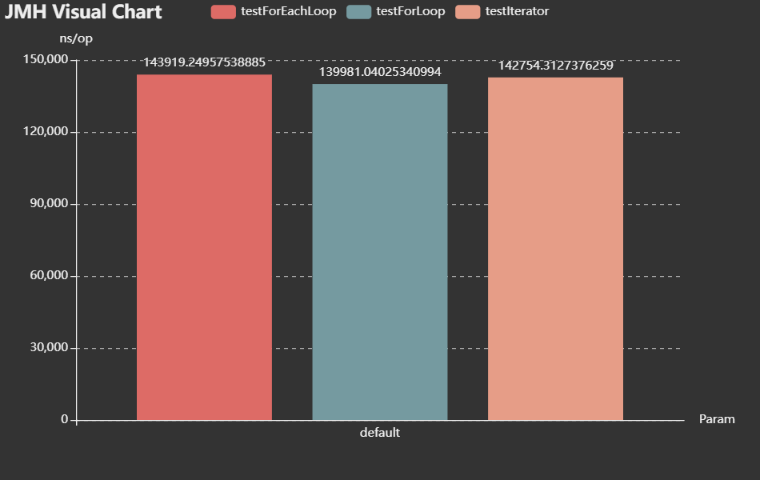

<!-- TOC -->
* [Java For-loop For-each Iterator 效率分析](#java-for-loop-for-each-iterator-效率分析)
  * [System.nanoTime 计时测试](#systemnanotime-计时测试)
    * [数量级：1,000](#数量级1000)
    * [数量级：10,000](#数量级10000)
    * [数量级：100,000](#数量级100000)
  * [JMH BenchMark 基准测试](#jmh-benchmark-基准测试)
    * [基准测试结果分析](#基准测试结果分析)
  * [三种循环的使用建议](#三种循环的使用建议)
    * [For-each 优势于 While-loop](#for-each-优势于-while-loop)
      * [预防Bug](#预防bug)
      * [为什么要“将局部变量的作用域最小化”](#为什么要将局部变量的作用域最小化)
    * [For-each 优势于 For-loop](#for-each-优势于-for-loop)
    * [For-each 无法使用的地方](#for-each-无法使用的地方)
    * [For-each 拓展使用](#for-each-拓展使用)
  * [总结](#总结)
<!-- TOC -->

# Java For-loop For-each Iterator 效率分析


## System.nanoTime 计时测试

- 使用 `System.nanoTime()` 作差计算耗时
- `LinkedList::get(int index)` 时间复杂度为 $O(n)$，loop 中的操作必须保持一致，因此用 `ArrayList` 做 `Iterator` 的集合

```java
import java.util.*;

public class Solution {

    public static final int MAGNITUDE = 10000;    // 数量级

    public static long testForloop(List<String> list) {
        long start, end;
        String str = null;
        start = System.nanoTime();
        for (int i = 0; i < MAGNITUDE; i++) {
            str = list.get(i);
        }
        end = System.nanoTime();
        return end - start;
    }

    public static long testForeach(List<String> list) {
        long start, end;
        String str = null;
        start = System.nanoTime();
        for (String s : list) {
            str = s;
        }
        end = System.nanoTime();
        return end - start;
    }

    public static long testIterator(List<String> list) {
        long start, end;
        String str = null;
        start = System.nanoTime();
        Iterator<String> iterator = list.iterator();
        while (iterator.hasNext()) {
            str = iterator.next();
        }
        end = System.nanoTime();
        return end - start;
    }

    public static void main(String[] args) {
        /* initialize */
        List<String> arrayList = new ArrayList<>();
        for (int i = 0; i < MAGNITUDE; i++) {
            arrayList.add(String.valueOf(i));
        }
        System.out.println("For loop: " + testForloop(arrayList));
        System.out.println("Foreach: " + testForeach(arrayList));
        System.out.println("Iterator: " + testIterator(arrayList));
    }
}
```

### 数量级：1,000

> For loop: 99000  
> Foreach: 321700  
> Iterator: 194500

### 数量级：10,000

> For loop: 933200  
> Foreach: 942500  
> Iterator: 585800

### 数量级：100,000

> For loop: 3730800  
> Foreach: 6669800  
> Iterator: 5215100

> 在小数量级上，`For-loop` 效率会高一点，`For < Iterator < For-each`，
> 这里得出的结论根据时间消耗得出，无法仔细比较效率高低，数量级小时，`For-loop` 效率高一点，整体来说，三者速度级别差不多。

## JMH BenchMark 基准测试

- 使用到 `JMH` 基准测试验证三种循环，数量级为百万

```java
import org.openjdk.jmh.annotations.*;
import org.openjdk.jmh.infra.Blackhole;
import org.openjdk.jmh.results.format.ResultFormatType;
import org.openjdk.jmh.runner.Runner;
import org.openjdk.jmh.runner.options.Options;
import org.openjdk.jmh.runner.options.OptionsBuilder;

import java.util.ArrayList;
import java.util.Iterator;
import java.util.List;
import java.util.concurrent.TimeUnit;

@State(Scope.Thread)
@BenchmarkMode(Mode.AverageTime)
@OutputTimeUnit(TimeUnit.NANOSECONDS)
@Fork(1)
@Warmup(iterations = 3)
@Measurement(iterations = 5)
public class JavaLoopBenchMarkTest {

    private static final int SIZE = 1_000_000;
    private String[] array;
    private List<String> arrayList;

    @Setup
    public void setup() {
        array = new String[SIZE];
        arrayList = new ArrayList<>(SIZE);
        for (int i = 0; i < SIZE; i++) {
            array[i] = String.valueOf(i);
            arrayList.add(array[i]);
        }
    }

    @Benchmark
    public void testForLoop(Blackhole bh) {
        for (int i = 0; i < SIZE; i++) {
            bh.consume(array[i]);
        }
    }

    @Benchmark
    public void testForEachLoop(Blackhole bh) {
        for (String s : array) {
            bh.consume(s);
        }
    }

    @Benchmark
    public void testIterator(Blackhole bh) {
        Iterator<String> iterator = arrayList.iterator();
        while (iterator.hasNext()) {
            bh.consume(iterator.next());
        }
    }

    public static void main(String[] args) throws Exception {
        Options opt = new OptionsBuilder()
                .include(JavaLoopBenchMarkTest.class.getSimpleName())
                .forks(1)
                .resultFormat(ResultFormatType.JSON)
                .result("benchmark-results.json")  // 生成 json 报告，JMH Visual Chart 可视化分析
                .build();
        new Runner(opt).run();
    }
}
```

### 基准测试结果分析

```text
Benchmark                               Mode  Cnt       Score      Error  Units
JavaLoopBenchMarkTest.testForEachLoop  avgt    5  143919.250 ± 8507.941  ns/op
JavaLoopBenchMarkTest.testForLoop      avgt    5  139981.040 ± 4770.272  ns/op
JavaLoopBenchMarkTest.testIterator     avgt    5  142754.313 ± 8949.872  ns/op
```



> 严格来讲三者速度几乎不相上下，硬是要说最快，应该是原生 `For-loop`, `For-each` 和 `Iterator` 应该是一样的

## 三种循环的使用建议

`《Effective Java》` 第三版第 58 条中建议，一般采用 `Foreach` 进行循环，因为它在 `简洁性`和 `预防Bug`上优于 `For-loop` 和 `Iterator`（确切说是 Iterator 配合 while 使用）

### For-each 优势于 While-loop

#### 预防Bug

- 说到预防Bug，这里牵涉到 第57条 中的 `将局部变量的作用域最小化`。

#### 为什么要“将局部变量的作用域最小化”

书中提到，原因类似于第 15 条的本质，**使类和成员的可访问性最小化**。  
将局部变量作用域最小化，可以增强代码的可读性和可维护性，并降低出错的可能性。

> 循环中提供了特殊的机会来将变量的作用域最小化。  
> 无论是传统的 for 循环，还是 for-each 形式的 for 循环，都允许声明**循环变量**，它们的作用域被限定**在正好需要的范围**之内。  
> 如果在循环终止之后**不再需要循环变量的内容**，for-loop 就优先于 while-loop。

- 如下是一种遍历集合的首选做法：

```java
// Preferred idiom for iterating over a collection or array
for (Element e : c) {
    ... // Do Someting with e
}
```

- 如果需要访问迭代器，可能要调用它的 `remove` 方法，首选做法是利用传统的 for 循环替代 `for-each` 循环：

```java
// Idiom for iterating when you need the iterator
for (Iterator<Element> i = c.iterator(); i.hasNext(); ) {
    Element e = i.next();
    ... // Do someting with e and i
}
```

为什么有些时候不能用 `for-each` ，鉴于它是基于 Iterator 的 `hasNext() + next()`，有时候需要在循环过程中对集合进行操作，  
此时就必须使用 Iterator 对象进行操作了，因为使用 Iterator 循环时，集合的操作权就交给 Iterator，  
虽然可以用集合对象进行操作，如 `romove()` 但这样会破坏 iterator 初始化的结果，导致最终程序运行的结果与预期偏差很大

- 至于为什么 for loop 要比 while loop 更好，参考一下代码片段，连续的两个 while loop，以及出现的一个 bug

```java
Iterator<Element> i = c.iterator();
while (i.hasNext()) {
    doSometing(i.next());
}
...
Iterator<Element> i2 = c.iterator();
while (i.hasNext()) {   // This is bug!
    doSometing(i2.next());
}
```

在第二个 while loop 中，使用了 迭代器 `i` 的判断，实际操作的是 `i2` 迭代器对象, `i` 迭代器发生泄露，而不会轻易被发现，IDE 也不会报错, 所以要利用好 for loop 声明迭代器，控制它的作用范围

上面 bug 程序最终的结果是下面的 while loop 不会执行，因为在上面的 while loop 执行结束之后，迭代器 `i` 就会遍历到尽头，继续判断 `i.hasNext()` 只会返回 `false`

### For-each 优势于 For-loop

- 以下面一个 两层集合嵌套迭代出现的 bug 来展开讨论

```java
// Can you spot the bug?
enum Suit {CLUB, DIAMOND, HEART, SPADE}
enum Rank {
    ACE, DEUCE, THREE, FOUR, FIVE, SIX, SEVEN,
    EIGHT, NINE, TEN, JACK, QUEEN, KING
}
...
static Collection<Suit> suits = Arrays.asList(Suit.values());
static Collection<Rank> ranks = Arrays.asList(Rank.values());

List<Card> deck = new ArrayList<>();
for (Iterator<Suit> i = suits.iterator(); i.hasNext(); )
    for (Iterator<Rank> j = ranks.iterator(); j.hasNext(); )
        deck.add(new Card(i.next(), j.next()));
    
```

bug在于，在迭代器上对外部的集合 suits 调用太多 `next` 方法，它应该从外部的循环进行调用，以便每种花色都调用一次，但它却是从内部循环调用，因此每次牌调用一次。在用完所有花色之后，循环就会抛出 `NoSuchElementException`异常。

如果碰巧外部集合的大小是内部集合大小的几倍（可能因为它们是相同的集合），循环就会正常终止，但是实际完成情况跟预期是有出入的。

- 下面是打印一对骰子出现的所有可能情况：

```java
// Same bug, different symptom!
enum Face {ONE, TWO, THREE, FOUR, FIVE, SIX}
Collection<Face> faces = EnumSet.allOf(Face.class);

for (Iterator<Face> i = faces.iterator(); i.hasNext(); )
    for (Iterator<Face> j = faces.iterator(); i.hasNext(); )
        System.out.println(i.next() + " " + j.next());
```

> ONE ONE  
> TWO TWO  
> THREE THREE  
> FOUR FOUR  
> FIVE FIVE  
> SIX SIX

同样的错误，也是重复调用 `next`。这种程序不会抛出异常，所以往往找 bug 会特别难受

- 下面开始修正此 bug

```java
// Fixed, but ugly - so we need for-each
for (Iterator<Suit> i = suits.iterator(); i.hasNext(); ) {
    Suit suit = i.next();
    for (Iterator<Rank> j = ranks.iterator(); j.hasNext(); )
        deck.add(new Card(suit, j.next()));
}
```

- 至此引出 for-each ，让这个问题完全消失，并且产生的代码也能很简洁。

```java
// Preferred idiom for neat iteration on collections and arrays
for (Suit suit : suits)
    for (Rank rank : ranks)
        deck.add(new Card(suit, rank));
```

### For-each 无法使用的地方

- `解构过滤`：如果需要遍历集合，并删除指定元素，需要使用显式的迭代器，以便使用它的 `remove` 方法。使用 Java 8 中添加的 Collection 的 `removeIf`，常常可以避免显式遍历。
- `转换`：如果需要遍历列表或者数组，并取代它的部分或者全部元素值，就需要列表迭代器或者数组索引，以便设置元素的值。
- `平行迭代`：如果需要并行地遍历多个集合，就需要显式地控制迭代器或者索引变量，以便所有迭代器或者索引变量都可以同步前进（就如上述有问题的牌和骰子的示例中无意间所示范的那样）


### For-each 拓展使用

- for-each 不止能遍历集合和数组，还能遍历实现 `Iterable` 接口的任何对象，只需要实现接口对应的方法即可。

```java
public interface Iterable<T> {
    /**
     * Returns an iterator over elements of type {@code T}.
     *
     * @return an Iterator.
     */
    Iterator<T> iterator();
    
    default void forEach(Consumer<? super T> action) {
        Objects.requireNonNull(action);
        for (T t : this) {
            action.accept(t);
        }
    }
}
```

- 比如写一个自定义的 LinkedList

```java
import java.util.Iterator;
import java.util.NoSuchElementException;

public class SimpleList<T> implements Iterable<T> {
    private Node<T> head;

    private static class Node<T> {
        T data;
        Node<T> next;

        Node(T data) {
            this.data = data;
            this.next = null;
        }
    }

    public void add(T data) {
        if (head == null) {
            head = new Node<>(data);
        } else {
            Node<T> current = head;
            while (current.next != null) {
                current = current.next;
            }
            current.next = new Node<>(data);
        }
    }

    @Override
    public Iterator<T> iterator() {
        return new Iterator<T>() {
            private Node<T> current = head;

            @Override
            public boolean hasNext() {
                return current != null;
            }

            @Override
            public T next() {
                if (!hasNext()) {
                    throw new NoSuchElementException();
                }
                T data = current.data;
                current = current.next;
                return data;
            }
        };
    }

    public static void main(String[] args) {
        SimpleList<String> list = new SimpleList<>();
        list.add("Hello");
        list.add("World");
        list.add("!");

        for (String s : list) {
            System.out.println(s);
        }
    }
}
```

## 总结

总而言之，与传统的 for 循环相比，for-each 循环在简洁性、灵活性以及出错预防性方面都占有绝对优势，并且**没有性能惩罚**的问题。  
因此，当可以选择的时候，`for-each` 循环应该优先于 for 循环。