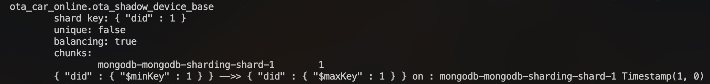

<!-- TOC -->
* [MongoDB 修改表分片规则](#mongodb-修改表分片规则)
  * [背景](#背景-)
  * [原理](#原理)
  * [解决方案](#解决方案)
    * [RenameCollection 影子拷贝](#renamecollection-影子拷贝)
    * [mongodump 和 mongorestore](#mongodump-和-mongorestore)
    * [mongoexport 和 mongoimport](#mongoexport-和-mongoimport)
<!-- TOC -->

# MongoDB 修改表分片规则


## 背景 

Golang 模块需要 upsert MongoDB 的一个 Collection，该表的分片键 Sharding key 规则是指定 `pid` 和 `did` 双主键，
业务上需要改为 `did` 单主键，直接使用 golang mongo-driver 的 `FindOneAndUpdate` 操作会报错

> `shadow fail to Update Mongodb (ShardKeyNotFound) Query for sharded findAndModify must contain the shard key`

原因是分片键的规则与查询的 filter 对不上（did 单主键

为了适配业务，需要将该表的分片规则进行修改，改为 did 单主键

测试环境：MongoDB 3.6 版本，分片两份 `shard-0` 和 `shard-1`

> 以下方案需要停机操作，无法做到读写操作同时修改（需要将原表删除

## 原理

参照 MySQL **影子拷贝法**

将待修改表 `base` 表 copy 一份影子 `base_tmp`，该影子的分片键规则进行修改，再将 `base` 表改为 `base_bak` 用于冗余保留备份，也可 dump 成文件，然后 `base_tmp` 改为 base 表

## 解决方案

### RenameCollection 影子拷贝

```bash
use admin;

// Step 1: 创建影子拷贝并设置新分片键
db.runCommand({
    shardCollection: "db_name.base",
    key: {did: 1}
});

use db_name;

// Step 2: 复制数据
db.base.find().forEach(function (doc) {
    db.base_tmp.insertOne(doc);
});

// Step 3: 重命名原始集合以保留备份
db.base.renameCollection("base_bak");

// Step 4: 重命名临时集合为原始集合
db.base_tmp.renameCollection("base");
```

实际操作会在 `renameCollection` 这一步报错

> `You can't rename a sharded collection`

不能修改一个分片的表，因此解决方案只能将数据 dump 出来，再 restore 回新分片的表里

### mongodump 和 mongorestore

```bash
// mongodump 备份数据
mongodump --host ip:port --username ROOT --password PASSWORD --authenticationDatabase admin --db DB_NAME --collection base --out=base.bak.d

// 删除 base 表
db.base.drop()

// 创建分片需要 root 账户，admin 表中
use admin;

// 创建影子拷贝并设置新分片键
db.runCommand({
    shardCollection: "db_name.base",
    key: {did: 1}
});

sh.status() // 检查新分片规则

mongorestore --host ip:port --username ROOT --password PASSWORD --authenticationDatabase admin --db DB_NAME --collection base --dir=ota_shadow_device_base.bak.d/DB_NAME/base.bson
```

> `Failed: ota_car_online.ota_shadow_device_base: error creating indexes for ota_car_online.ota_shadow_device_base: 
> createIndex error: { mongodb-mongodb-sharding-shard-0/mongodb-mongodb-sharding-shard0-data-0.mongodb-mongodb-sharding-headless.bota-basic.svc.cluster.local:27017,
> mongodb-mongodb-sharding-shard0-data-1.mongodb-mongodb-sharding-headless.bota-basic.svc.cluster.local:27017,
> mongodb-mongodb-sharding-shard0-data-2.mongodb-mongodb-sharding-headless.bota-basic.svc.cluster.local:27017: 
> "request doesn't allow collection to be created implicitly", 
> mongodb-mongodb-sharding-shard-1/mongodb-mongodb-sharding-shard1-data-0.mongodb-mongodb-sharding-headless.bota-basic.svc.cluster.local:27017,
> mongodb-mongodb-sharding-shard1-data-1.mongodb-mongodb-sharding-headless.bota-basic.svc.cluster.local:27017,
> mongodb-mongodb-sharding-shard1-data-2.mongodb-mongodb-sharding-headless.bota-basic.svc.cluster.local:27017: 
> "cannot create unique index over { pid: 1.0, did: 1.0 } with shard key pattern { did: 1.0 }" }`

使用 `mongodump` 指定 collection 只导出该 collection 的 bson 信息，但是还会带有额外的原始集合元数据，包括分片信息，因此旧数据的分片规则并不适用新分片集合中，所以 `mongorestore` 会报错

### mongoexport 和 mongoimport

mongoexport 和 mongoimport 的组合，一般涉及到单表，且纯数据操作，不涉及与 MongoDB 属性绑定的场景，例如导出导入 json csv 数据，因此使用该方案。

```bash
# 修改 ota_shadow_device_base 分片规则

# 1. 在 /mongodb/bin 目录下，将 ota_shadow_device_base 数据备份
mongoexport --host IP:PORT --username $ROOT --password $PASSWORD --authenticationDatabase admin --db $DB_NAME --collection ota_shadow_device_base --out ota_shadow_device_base.json --readPreference primary

# 2. 删除原集合(务必先执行上述备份
mongo --host IP:PORT --username $ROOT --password $PASSWORD --authenticationDatabase admin --eval "db.ota_shadow_device_base.drop();" ota_car_online

# 3. 使用 ROOT 账户进入 mongo-cli
# 手动创建集合，建立索引
use ota_car_online;
db.createCollection('ota_shadow_device_base');
db.ota_shadow_device_base.createIndex({did: 1}, {unique: true});
db.ota_shadow_device_base.createIndex({pid: 1});
# 手动创建集合分片规则（需 ROOT 账户才能创建
use admin;
db.runCommand({shardCollection: 'ota_car_online.ota_shadow_device_base', key: {did: 1}});
# 以下命令检查分片规则是否生效
# ota_car_online.ota_shadow_device_base, shard key: { "did" : 1 }
sh.status();

# 4. 数据还原
# 退出 mongo-cli，在备份文件根目录处恢复数据，按照新分片规则导入数据
mongoimport --host IP:PORT --username $ROOT --password $PASSWORD --authenticationDatabase admin --db $DB_NAME --collection ota_shadow_device_base --file ota_shadow_device_base.json --writeConcern majority
```

`sh.status()` 查看分片是否设置成功

