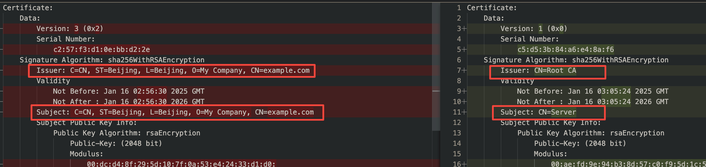

<!-- TOC -->

* [OpenSSL 及 X509 证书相关](#openssl-及-x509-证书相关)
* [哈希计算](#哈希计算)
* [编解码](#编解码)
* [验证网站证书链](#验证网站证书链)
* [随机数](#随机数)
* [RSA](#rsa)
  * [RSA 公私钥生成](#rsa-公私钥生成)
  * [RSA 私钥加密签名, 公钥验签](#rsa-私钥加密签名-公钥验签)
  * [RSA 公钥加密, 私钥解密](#rsa-公钥加密-私钥解密)
* [X.509 证书相关操作](#x509-证书相关操作)
  * [DER 和 PEM 格式转换](#der-和-pem-格式转换)
  * [几种提取公钥的方法](#几种提取公钥的方法)
  * [私钥生成自签名证书](#私钥生成自签名证书)
    * [自签名证书的两种方式对比](#自签名证书的两种方式对比)
    * [快速生成证书和密钥](#快速生成证书和密钥)
  * [校验私钥与证书是否匹配](#校验私钥与证书是否匹配)
  * [CA 签发证书](#ca-签发证书)
    * [CA签发证书与自签名证书不同点](#ca签发证书与自签名证书不同点)
  * [使用配置文件创建 CSR 和 X509 证书](#使用配置文件创建-csr-和-x509-证书)
    * [配置文件创建 CSR](#配置文件创建-csr)
    * [配置文件创建 X509 证书](#配置文件创建-x509-证书)
  * [X509v3 扩展参数](#x509v3-扩展参数)
  * [PKCS 证书格式转换](#pkcs-证书格式转换)
    * [PKCS#1, PKCS#8, PKCS#10, x509 证书相关](#pkcs1-pkcs8-pkcs10-x509-证书相关)
    * [PKCS#1 和 PKCS#8 互转](#pkcs1-和-pkcs8-互转)
    * [PKCS#7 证书链相关](#pkcs7-证书链相关)
    * [PKCS#12 相关](#pkcs12-相关)
* [ECC](#ecc)
  * [ECC 转换格式](#ecc-转换格式)
  * [ECDSA 签名与验签](#ecdsa-签名与验签)
  * [ECDH 非对称加密](#ecdh-非对称加密)
  * [生成自签名 ECC 证书](#生成自签名-ecc-证书)
* [AES](#aes)
* [Reference](#reference)

<!-- TOC -->

# OpenSSL 及 X509 证书相关


# 哈希计算

```bash
# 计算 SHA256 哈希值
openssl dgst -sha256 plaintext.txt
openssl sha256 plaintext.txt
# 等价于：sha256sum plaintext.txt

# 计算 MD5 哈希值
openssl dgst -md5 plaintext.txt
# 等价于：md5sum plaintext.txt

# HMAC
# 不指定，默认为 HMAC-SHA256
openssl dgst -hmac "key" plaintext.txt 
# HMAC-MD5
openssl dgst -hmac "key" -md5 plaintext.txt
# HMAC-SHA1
openssl dgst -hmac "key" -sha1 plaintext.txt
# HMAC-SHA256
openssl dgst -hmac "key" -sha256 plaintext.txt
```

# 编解码

```bash
# 编码
openssl base64 -in plaintext.txt -out encoded.txt

# 解码
openssl base64 -d -in encoded.txt -out decoded.txt
```

# 验证网站证书链

```bash
# 获取网站的完整证书链信息
openssl s_client -showcerts -connect example.com:443

# 保存完整证书链
# </dev/null：确保输入为空。
# 2>/dev/null：将错误输出重定向到空设备，以避免显示不必要的错误信息。
# awk '/BEGIN CERTIFICATE/,/END CERTIFICATE/'：使用 awk 提取从 BEGIN CERTIFICATE 到 END CERTIFICATE 的所有内容。
openssl s_client -connect example.com:443 -showcerts </dev/null 2>/dev/null | awk '/BEGIN CERTIFICATE/,/END CERTIFICATE/' >> full_chain.pem

# 查看完整证书链信息
openssl x509 -in full_chain.pem -text -noout
```

# 随机数

```bash
# 生成 16 字节的随机数（二进制），并将其保存到 random.bin 文件中，可以用于 AES-128 加密
openssl rand -out random.bin 16
# 生成一个 32 字节的随机密钥，适用于 AES-256 加密
openssl rand -out key.bin 32
# 生成一个 12 字节的随机密码，并以 Base64 编码格式输出
openssl rand -base64 12
# 生成 16 字节的随机数，并以十六进制格式输出到控制台
openssl rand -hex 16

# 生成 32 字节长度二进制随机数，字符数为 32
openssl rand 32 | wc -c # 32
```

# RSA

## RSA 公私钥生成

```bash
# 生成 2048 位 RSA 私钥
# 后面数字笔试私钥位数，可以选择更长的 4096
openssl genrsa -out private_key.pem 2048 # 简单的生成 rsa 密钥
openssl genrsa -aes256 -out private_key.pem 2048 # 可以对密钥进行 aes-cbc-256 加密

openssl rsa -in encrypted_private_key.pem -out decrypted_private_key.pem # 去除 rsa 密钥
openssl rsa -in private_key.pem -out encrypted_private_key.pem -aes256 # 给 rsa 密钥对称加密

# genpkey 可以生成很多种算法的密钥
openssl genpkey -algorithm RSA -out private_key.pem -pkeyopt rsa_keygen_bits:2048
# 可以生成带加密的密钥，-aes128, -aes192, -aes256, -des, -des3, -camellia256, -camellia128, -camellia192
# 在使用密钥的地方，例如提取公钥时，会要求输入生成密钥时一样的加密密钥解密
openssl genpkey -algorithm RSA -out private_key.pem -pkeyopt rsa_keygen_bits:2048 -aes256

# 从私钥导出公钥
# -pubout 导出公钥文件，不加导出来的仍然是私钥
# 默认导出格式是 base64 的文本 PEM 格式，可以指定 -outform DER 指定二进制文本
# -outform DER or PEM
openssl rsa -in private_key.pem -out public_key.pem -pubout

# 从服务器证书导出公钥
# 导出一个网站的服务器证书
echo | openssl s_client -connect baidu.com:443 -servername baidu.com | openssl x509 > server.crt
# x509 证书中提取公钥文件
openssl x509 -in server.crt -pubkey -noout > publickey.pem
# 打印公钥文件内容，查看信息（也可以作为校验方式）
openssl rsa -pubin -in publickey.pem -text -noout
```

## RSA 私钥加密签名, 公钥验签

```bash
# 生成私钥
openssl genpkey -algorithm RSA -out private_key.pem -pkeyopt rsa_keygen_bits:2048
# 从私钥中提取公钥
openssl rsa -pubout -in private_key.pem -out public_key.pem
# 生成待加密文件
echo "这是一个需要加密的消息。" > message.txt

# 私钥签名
openssl dgst -sha256 -sign private_key.pem -out signature.bin message.txt

# 公钥验签
openssl dgst -sha256 -verify public_key.pem -signature signature.bin message.txt
```

## RSA 公钥加密, 私钥解密

```bash
# 生成私钥
openssl genpkey -algorithm RSA -out private_key.pem -pkeyopt rsa_keygen_bits:2048
# 从私钥中提取公钥
openssl rsa -pubout -in private_key.pem -out public_key.pem
# 生成待加密文件
echo "这是一个需要加密的消息。" > message.txt

# 公钥加密
openssl rsautl -encrypt -inkey public_key.pem -pubin -in message.txt -out encrypted_message.bin

# 私钥解密
openssl rsautl -decrypt -inkey private_key.pem -in encrypted_message.bin -out decrypted_message.txt

# 比对解密文件和原文件
cmp message.txt decrypted_message.txt
diff message.txt decrypted_message.txt
md5sum message.txt decrypted_message.txt
```

# X.509 证书相关操作

在 X.509 证书中，`subject`是指证书的主题信息，通常包括以下几个部分：

1. `C`：国家代码（Country Name）
2. `ST`：省份或州代码（State or Province Name）
3. `L`：城市或地区代码（Locality Name）
4. `O`：组织名称（Organization Name）
5. `OU`：组织单位名称（Organizational Unit Name）
6. `CN`：通用名称（Common Name）
7. `emailAddress`：电子邮件地址（Email Address）

```bash
# subject 字符串
/C=CN/ST=Beijing/L=Beijing/O=Example/CN=example.com/emailAddress=info@example.com
```

## DER 和 PEM 格式转换

```bash
# PEM 转 DER
openssl x509 -in mycert.pem -outform DER -out mycert.der
# DER 转 PEM
openssl x509 -in mycert.der -inform DER -outform PEM -out mycert.pem
```

## 几种提取公钥的方法

```bash
# 1. 从 RSA 私钥中提取公钥
# -pubout 提取公钥
openssl rsa -pubout -in private_key.pem -out public_key.pem

# 2. 从 CSR（证书签名请求）中提取公钥
# -noout 不打印出 CSR 原文
# -pubkey 提取公钥（创建该 CSR 的服务器私钥对应的公钥
openssl req -in server.csr -noout -pubkey > public_key.pem

# 3. 从 X.509 证书中提取公钥
# -pubkey 提取公钥（创建该证书的服务器私钥对应的公钥
openssl x509 -in server.crt -noout -pubkey > public_key.pem

# 4. 从 PKCS#12 文件中提取公钥
# 先将 p12 提取不带证书的私钥
openssl pkcs12 -in your_file.p12 -nocerts -out private_key.pem
# 再将该私钥提取公钥
openssl rsa -in private_key.pem -pubout
```

## 私钥生成自签名证书

```bash
# 生成私钥
openssl genrsa -out private_key.pem 2048

# 创建 CSR 证书请求，会依次填写以下信息
# CA 证书 Common Name 需要保证唯一性，不要与服务端证书或者客户端证书的 Common Name 相同

# Country Name (2 letter code) [XX]:cn
# State or Province Name (full name) []:bj
# Locality Name (eg, city) [Default City]:bj
# Organization Name (eg, company) [Default Company Ltd]:alibaba
# Organizational Unit Name (eg, section) []:test
# Common Name (eg, your name or your servers hostname) []:root
# Email Address []:a.alibaba.com
# A challenge password []:
# An optional company name []:
openssl req -new -key private_key.pem -out csr.pem
# 查看 CSR 证书信息
openssl req -in csr.pem -noout -text

# 生成自签名证书
# openssl x509 不指定 -CA 和 -CAkey, 额外添加 -signkey 指定一个密钥，即可完成无 CA 的自签名证书
openssl x509 -req -days 365 -in csr.pem -signkey private_key.pem -out certificate.pem
# 或者直接用 subj 代替 csr
# -subj 直接用私钥签发证书，跳过 CSR 创建（subject 表达式包含 CSR 所有内容）
openssl req -new -x509 -key private_key.pem -out certificate.pem -days 365 -subj "/C=CN/ST=Beijing/L=Beijing/O=My Company/CN=example.com"

# 查看证书信息
openssl x509 -in certificate.pem -text -noout
```

### 自签名证书的两种方式对比

使用 `openssl x509` 签发证书，需要输入 CSR 文件，其生成的证书版本为 Version 1，少了 X509v3 的额外标识；（openssl 3.0 以上版本默认生成
X509v3

使用 `openssl req` 签发证书，可以用 `-subj` 替代 CSR 文件，其证书版本为 X509v3，有额外的标识信息；


### 快速生成证书和密钥

这种方式一般可以快速生成 CA 证书及其密钥；

不适用于 CA 签发的证书，因为 CA 签发证书需要用 `openssl x509`，需要指定 CSR 文件，而不能用 `-subj` 替代 CSR，另外
`openssl req` 也没有 `-CA` `-CAKey` 选项；只能单独生成 CSR 文件，用 `openssl x509` 签发证书；

使用 `openssl req` 默认生成 `-keyout` 的密钥文件是带加密的 `pkcs#8`，可以用 `openssl rsa` 转为 `pkcs#1` 非加密密钥；也可以执行时添加
`-nodes`，直接生成不加密密钥

```bash
# 根据 -subj 内容签发证书，密钥自动生成
# -nodes，表示生成的密钥是原密钥，不带对称加密，否则需要手动输入对称加密密钥, openssl v3.0 替换为 -noenc
# -newkey rsa:2048，表示生成的密钥为 RSA 密钥，2048 位，同样支持 1024, 3072, 4096, 8192 等
# -keyout, 指定输出的密钥文件
# -out, 指定签发的证书文件
# -days, 指定有效期，开始时间从签发时刻算起
openssl req -x509 -new -nodes -keyout rootCA.key -out rootCA.pem -days 365 -subj "/CN=Root CA" -newkey rsa:2048
```

**openssl 3.0** 以上版本，`openssl req` 可以附加 `-CA` 和 `-CAKey` 选项，实现快速 CA 签发证书

```bash
openssl req -x509 -new -nodes -keyout server.key -out server.crt -days 365 -subj "/CN=server.example.com" -CA rootCA.pem -CAkey rootCA.key
```

**openssl 3.0** 以上，可以设置证书有效期起始时间和终止时间 `-not_before` `-not_after` ，日期格式为 `YYYYMMDDHHMMSSZ`，其中
`Z`表示 UTC 时区。`-not_after` 会将 `-days` 覆盖失效；如果只用 `-not_before` 和 `-days` ，终止时间是从执行命令开始计算 +
days 天的时间，而不是起始时间开始追加；

```bash
openssl req -x509 -new -nodes -keyout server.key -out server.crt -subj "/CN=server.example.com" -CA rootCA.pem -CAkey rootCA.key -not_before 20060102150405Z -not_after 20250102150405Z
```

## 校验私钥与证书是否匹配

```bash
# 生成自签名证书
openssl genrsa -out server.key 2048
openssl req -new -x509 -key server.key -out server.crt -days 365 -subj "/C=CN/ST=Beijing/L=Beijing/O=My Company/CN=example.com"
# 计算证书和私钥的模数，相等则匹配
openssl x509 -in server.crt -noout -modulus | openssl md5
openssl rsa -in server.key -noout -modulus | openssl md5
```

## CA 签发证书

```bash
# 快速生成根证书和密钥
openssl req -x509 -new -nodes -keyout rootCA.key -out rootCA.pem -days 365 -subj "/CN=Root CA" -newkey rsa:2048
# 生成服务器密钥和 CSR
openssl genrsa -out server.key 2048
openssl req -new -key server.key -out server.csr -subj "/CN=Server"
# 验证 CSR
openssl req -in server.csr -noout -text
# 使用根证书签署服务器证书
# -CAcreateserial, 生成一个序列号并将其写入一个名为 serial 的文件
openssl x509 -req -in server.csr -CA rootCA.pem -CAkey rootCA.key -CAcreateserial -out server.crt -days 365
# 验证证书
openssl x509 -in server.crt -noout -text
# 用 CA 证书验证服务器证书
openssl verify -CAfile rootCA.pem server.crt
```

> 使用 CA 签发证书不能使用上述「快速生成证书和密钥」，因为需要用到 CSR 文件，因此需要单独生成密钥和 CSR

### CA签发证书与自签名证书不同点

- 自签名证书的 Issuer 颁发者也是自己
- CA 签发证书的 Issuer 是 CA



## 使用配置文件创建 CSR 和 X509 证书

配置文件的创建方式较为麻烦，但是提供更加精细化的定制配置，一般来说以上的创建方式足够自签名使用，无需配置文件方式创建；

### 配置文件创建 CSR

创建 `csr.cnf` 文件

```bash
# 配置文件用于生成 CSR
[ req ]
default_bits        = 2048           # 密钥长度，常见值：2048(常用), 3072, 4096
default_keyfile     = server.key     # 生成的私钥文件名
default_md          = sha256         # 签名哈希算法，推荐使用 SHA256(常用), SHA384, SHA512
prompt              = no             # 是否交互式输入信息
distinguished_name  = req_distinguished_name  # 指定主体字段的配置部分
req_extensions      = req_ext        # CSR 的扩展部分，引用 [req_ext]

[ req_distinguished_name ]
C                   = CN             # 国家代码（两位字母，如 CN、US）
ST                  = Beijing        # 州或省份
L                   = Beijing        # 城市
O                   = ExampleCorp    # 组织名称
OU                  = IT Department  # 组织单元
CN                  = example.com    # 通用名称（域名或 IP 地址）

[ req_ext ]
subjectAltName      = @alt_names     # 引用 [alt_names] 定义 SAN 扩展
basicConstraints    = critical,CA:TRUE,pathlen:0 # 基本约束
keyUsage            = critical, digitalSignature, keyEncipherment # 公钥用途
extendedKeyUsage    = serverAuth, clientAuth # 扩展用途
subjectKeyIdentifier = hash # 主题密钥标识符
crlDistributionPoints = @disribution_points # CRL 分发点
certificatePolicies = 1.3.6.1.4.1.12345.1.1.1, 1.2.3.4.5.6.7.8.9.1 # 证书策略
authorityInfoAccess = OCSP;URI:http://ocsp.example.com/, caIssuers;URI:http://myca.example.com/ca.cer # 授权信息访问

[ alt_names ]
DNS.1               = example.com    # 替代名称：域名
DNS.2               = www.example.com # 替代名称：子域名
IP.1                = 192.168.1.1    # 替代名称：IP 地址
email               = info@example.com # 替代名称：邮箱

[ disribution_points ]
URI                 = http://crl.example.com/crl.pem
```

```bash
# 生成根证书和密钥
openssl req -x509 -new -nodes -keyout rootCA.key -out rootCA.pem -days 365 -subj "/CN=Root CA" -newkey rsa:2048
# 生成服务器私钥和 CSR 文件
# -nodes，生成不加密的服务器密钥
# -config 指定 CSR 配置文件
openssl req -new -nodes -config csr.cnf -out server.csr
# 查看 CSR 内容
openssl req -in server.csr -noout -text
```

CSR 内容：

```bash
Subject: C=CN, ST=Beijing, L=Beijing, O=ExampleCorp, OU=IT Department, CN=example.com
...
Requested Extensions:
    X509v3 Subject Alternative Name: 
        DNS:example.com, DNS:www.example.com, IP Address:192.168.1.1, email:info@example.com
    X509v3 Basic Constraints: critical
        CA:TRUE, pathlen:0
    X509v3 Key Usage: critical
        Digital Signature, Key Encipherment
    X509v3 Extended Key Usage: 
        TLS Web Server Authentication, TLS Web Client Authentication
    X509v3 Subject Key Identifier: 
        73:80:FD:8E:8F:D0:7E:4E:CB:87:A2:DC:60:44:4B:4F:66:70:73:5A
    X509v3 CRL Distribution Points: 
        Full Name:
          URI:http://crl.example.com/crl.pem
    X509v3 Certificate Policies: 
        Policy: 1.3.6.1.4.1.12345.1.1.1
        Policy: 1.2.3.4.5.6.7.8.9.1
    Authority Information Access: 
        OCSP - URI:http://ocsp.example.com/
        CA Issuers - URI:http://myca.example.com/ca.cer
```

> 注：该 CSR 里的扩展内容 Requested Extensions，直接应用到 X509 证书签发时，不会直接应用到证书中；例如 CSR 虽然配置了 SAN，但是
> X509 证书是没有的，必须在签发 X509 证书时显式指定出来

```bash
# 使用根证书签署服务器证书
openssl x509 -req -in server.csr -CA rootCA.pem -CAkey rootCA.key -CAcreateserial -out server.crt -days 365
# 验证证书
openssl x509 -in server.crt -noout -text
# 用 CA 证书验证服务器证书
openssl verify -CAfile rootCA.pem server.crt
```

实际只有基础项，而不具有扩展内容

```bash
X509v3 extensions:
    X509v3 Subject Key Identifier: 
        73:80:FD:8E:8F:D0:7E:4E:CB:87:A2:DC:60:44:4B:4F:66:70:73:5A
    X509v3 Authority Key Identifier: 
        30:7B:AA:31:4F:DA:F0:F4:22:22:6B:E9:96:C4:BF:A5:84:10:DB:03
```

### 配置文件创建 X509 证书

创建 X509v3 配置文件 `v3.ext`

```bash
# 配置文件用于签发证书时的扩展设置

# CA 证书扩展
[ v3_ca ]
authorityKeyIdentifier = keyid:always,issuer  # 授权密钥标识符
basicConstraints       = critical,CA:TRUE,pathlen:1  # 标记为 CA，限制链长度
keyUsage               = critical, digitalSignature, keyCertSign, cRLSign  # 密钥用途
subjectKeyIdentifier   = hash  # 主题密钥标识符
nameConstraints        = permitted;email:.example.com;DNS:.example.com  # 名称约束

# 服务器证书扩展
[ v3_server ]
authorityKeyIdentifier = keyid,issuer  # 授权密钥标识符
subjectKeyIdentifier   = hash # 主题密钥标识符
basicConstraints       = critical,CA:FALSE  # 标记为非 CA 证书
keyUsage               = critical, digitalSignature, keyEncipherment  # 密钥用途
extendedKeyUsage       = serverAuth,clientAuth  # 扩展密钥用途，标记为服务器认证和客户端认证
subjectAltName         = DNS:example.com, DNS:www.example.com, IP:192.168.1.1, email:info@example.com  # SAN 扩展
crlDistributionPoints  = URI:http://example.com/crl.pem  # CRL 分发点
certificatePolicies    = 1.3.6.1.4.1.12345.1.1.1, 1.2.3.4.5.6.7.8.9.1 # 证书策略
authorityInfoAccess    = OCSP;URI:http://ocsp.example.com/, caIssuers;URI:http://myca.example.com/ca.cer # 授权信息访问

# 客户端证书扩展
[ v3_client ]
authorityKeyIdentifier = keyid,issuer
basicConstraints       = CA:FALSE
keyUsage               = critical, digitalSignature, keyEncipherment
extendedKeyUsage       = clientAuth  # 客户端认证用途
subjectAltName         = email:client@example.com
nsComment              = "OpenSSL Generated Certificate"  # 注释

# OCSP 证书扩展
[ v3_ocsp ]
authorityKeyIdentifier = keyid,issuer
basicConstraints       = CA:FALSE
keyUsage               = critical, digitalSignature
extendedKeyUsage       = OCSPSigning  # OCSP 签名用途

# 时间戳证书扩展
[ v3_timestamp ]
authorityKeyIdentifier = keyid,issuer
basicConstraints       = CA:FALSE
keyUsage               = critical, digitalSignature
extendedKeyUsage       = timeStamping  # 时间戳用途
```

延续上方示例，生成 `rootCA.pem`, `rootCA.key`, `server.csr`；

使用配置文件的方式，创建 CA 签发的服务器 X509v3 证书

在根证书签发服务器证书基础上，添加 `-extfile` 指定以上配置文件，同时 `-extensions` 指定对应的证书扩展项名，如服务器证书扩展是
`v3_server`，名字可以自定义；如果该配置文件平铺，不归类，类似 `properties` 配置文件形式，则可以忽略 `-extensions`

```bash
# -extfile 指定 x509v3 配置文件
openssl x509 -req -in server.csr -CA rootCA.pem -CAkey rootCA.key -CAcreateserial \
    -out server.crt -days 365 -extfile v3.ext -extensions v3_server
# CA 验证证书
openssl verify -CAfile rootCA.pem server.crt
```

证书扩展内容：

```bash
X509v3 extensions:
    X509v3 Subject Key Identifier: 
        73:80:FD:8E:8F:D0:7E:4E:CB:87:A2:DC:60:44:4B:4F:66:70:73:5A
    X509v3 Authority Key Identifier: 
        30:7B:AA:31:4F:DA:F0:F4:22:22:6B:E9:96:C4:BF:A5:84:10:DB:03
    X509v3 Basic Constraints: critical
        CA:FALSE
    X509v3 Key Usage: critical
        Digital Signature, Key Encipherment
    X509v3 Extended Key Usage: 
        TLS Web Server Authentication, TLS Web Client Authentication
    X509v3 Subject Alternative Name: 
        DNS:example.com, DNS:www.example.com, IP Address:192.168.1.1, email:info@example.com
    X509v3 CRL Distribution Points: 
        Full Name:
          URI:http://example.com/crl.pem
    X509v3 Certificate Policies: 
        Policy: 1.3.6.1.4.1.12345.1.1.1
        Policy: 1.2.3.4.5.6.7.8.9.1
    Authority Information Access: 
        OCSP - URI:http://ocsp.example.com/
        CA Issuers - URI:http://myca.example.com/ca.cer
```

其他类型证书同理，只需要修改 `-extensions` 找到对应分组即可，或单独创建配置文件

## X509v3 扩展参数

X.509 v3 证书通过扩展字段增加功能和灵活性，以下是常见的扩展：

<details>
<summary>Basic Constraints: 指示证书的基本约束</summary>

- **CA（Certificate Authority）**：指示该证书是否可以用作证书颁发机构的证书。如果设置为 `CA:TRUE`，则表示该证书可以用于签发其他证书；如果设置为
  `CA:FALSE`，则表示该证书不能用于签发其他证书。
- **路径长度限制（Path Length Constraint）**：这是一个可选的整数值，表示从该证书开始的证书链中，最多可以有多少个中间 CA 证书（该
  CA 证书允许签发证书数上限）。如果没有设置路径长度限制，则表示没有限制。
- 当 `basicConstraints` 被标记为 `critical` 时，表示该扩展是关键的，必须被所有使用该证书的应用程序理解。如果应用程序不支持或不理解这个扩展，它应该拒绝使用该证书。这意味着
  `basicConstraints` 的存在和内容对于证书的正确使用是至关重要的。

```bash
basicConstraints = critical,CA:FALSE,pathlen:2
```

```bash
X509v3 extensions:
    X509v3 Basic Constraints: critical
        CA:FALSE, pathlen:2
```

</details>

<details>
<summary>Key Usage: 定义公钥的用途，如签名、加密或密钥协商等</summary>

- **digitalSignature**: 允许使用该公钥进行数字签名，例如用于身份验证和数据完整性。(常用
- **nonRepudiation**: 允许使用该公钥进行不可否认性签名，通常用于证明某个操作的真实性。
- **keyEncipherment**: 允许使用该公钥加密密钥，例如在 SSL/TLS 中用于加密会话密钥。（常用
- **dataEncipherment**: 允许使用该公钥加密数据。
- **keyAgreement**: 允许使用该公钥进行密钥协商，例如在 Diffie-Hellman 密钥交换中。
- **keyCertSign**: 允许使用该公钥签署证书。（通常用于 CA 证书
- **cRLSign**: 允许使用该公钥签署证书撤销列表 (CRL)。（通常用于 CA 证书
- **encipherOnly**: 仅允许使用该公钥进行加密操作，通常用于密钥协商。
- **decipherOnly**: 仅允许使用该公钥进行解密操作，通常用于密钥协商。

```bash
keyUsage = critical, digitalSignature, keyEncipherment
```

```bash
X509v3 Key Usage: critical
        Digital Signature, Key Encipherment
```

</details>

<details>
<summary>Extended Key Usage (EKU): 进一步定义证书中公钥的特定用途</summary>

- **serverAuth**: 允许证书用于服务器身份验证，通常用于 SSL/TLS 服务器证书。(常用
- **clientAuth**: 允许证书用于客户端身份验证，通常用于 SSL/TLS 客户端证书。(常用
- **codeSigning**: 允许证书用于代码签名，确保软件的完整性和来源。
- **emailProtection**: 允许证书用于电子邮件保护，通常用于 S/MIME 电子邮件加密和签名。
- **timeStamping**: 允许证书用于时间戳服务，确保数据在特定时间点的存在性。
- **OCSPSigning**: 允许证书用于在线证书状态协议 (OCSP) 签名，通常用于证书状态检查。
- **ipsecEndSystem**: 允许证书用于 IPsec 终端系统。
- **ipsecTunnel**: 允许证书用于 IPsec 隧道。
- **ipsecUser**: 允许证书用于 IPsec 用户。

```bash
extendedKeyUsage = serverAuth, clientAuth
```

```bash
X509v3 Extended Key Usage: 
TLS Web Server Authentication, TLS Web Client Authentication
```

</details>

<details>
<summary>Subject Alternative Name (SAN): 用于指定证书的替代主题名称，这些名称可以是 DNS 名称、IP 地址、电子邮件地址等，这使得证书可以支持多个域名或其他标识符，而不需要为每个名称单独生成证书</summary>

- 多域名支持: SAN 允许一个证书同时支持多个域名。例如，一个 SSL/TLS 证书可以同时保护 www.example.com 和 example.net。
- IP 地址: SAN 可以包含 IP 地址，允许证书用于特定的 IP 地址。
- 电子邮件地址: SAN 也可以包含电子邮件地址，适用于 S/MIME 证书。
- 其他名称: SAN 还可以包含其他类型的名称，例如 URI 或其他自定义标识符。

```bash
subjectAltName = DNS:www.example.com, DNS:example.com, IP:192.168.1.1, email:info@example.com
```

```bash
X509v3 Subject Alternative Name: 
DNS:www.example.com, DNS:example.com, IP Address:192.168.1.1, email:info@example.com
```

</details>

<details>
<summary>Authority Key Identifier (AKI): 用于帮助识别签发该证书的证书颁发机构 (CA) 的公钥，是签发该证书 CA 的公钥哈希值</summary>

```bash
authorityKeyIdentifier=keyid,issuer
```

```bash
X509v3 Authority Key Identifier: 
keyid:CD:EE:95:A0:85:70:4B:59:6D:99:CA:6D:BE:7D:EB:FB:88:7B:64:35
```

</details>

<details>
<summary>Subject Key Identifier (SKI): 是当前证书的公钥哈希值，如果使用该证书（CA）签发其他的证书，则子证书的 AKI 对应本证书的 SKI</summary>

```bash
subjectKeyIdentifier = hash
```

```bash
X509v3 Subject Key Identifier: 
B9:AE:C9:13:AD:A7:C4:E4:51:A5:56:18:5C:2B:F6:E4:1E:95:C6:AB
```

</details>

<details>
<summary>CRL Distribution Points (CRL DP): 用于指示证书撤销列表 (CRL) 的分发位置</summary>

```bash
crlDistributionPoints = URI:http://crl.example.com/crl.pem
```

```bash
X509v3 CRL Distribution Points: 

Full Name:
    URI:http://crl.example.com/crl.pem
```

</details>

<details>
<summary>Certificate Policies: 使用逗号分隔的格式来定义多个政策。每个政策由 OID 和相应的限定符</summary>

```bash
certificatePolicies = 1.3.6.1.4.1.12345.1.1.1, 1.2.3.4.5.6.7.8.9.1
```

```bash
X509v3 Certificate Policies: 
Policy: 1.3.6.1.4.1.12345.1.1.1
Policy: 1.2.3.4.5.6.7.8.9.1
```

</details>

<details>
<summary>Authority Information Access (AIA): 用于提供有关如何访问证书颁发机构 (CA) 的信息，通常包含指向 CA 证书和在线证书状态协议 (OCSP) 服务器的 URL</summary>

```bash
authorityInfoAccess = OCSP;URI:http://ocsp.example.com/, caIssuers;URI:http://myca.example.com/ca.cer
```

```bash
Authority Information Access: 
OCSP - URI:http://ocsp.example.com/
CA Issuers - URI:http://myca.example.com/ca.cer
```

</details>

```bash
# 生成根证书和密钥
openssl req -x509 -new -nodes -keyout rootCA.key -out rootCA.pem -days 365 -subj "/CN=Root CA" -newkey rsa:2048
# 生成服务器密钥和 CSR：
openssl genrsa -out server.key 2048
openssl req -new -key server.key -out server.csr -subj "/CN=Server"

# 创建扩展配置文件：
# 创建一个文件 v3.ext，包含如下内容：
authorityKeyIdentifier=keyid,issuer
basicConstraints=CA:FALSE
keyUsage=digitalSignature, keyEncipherment
extendedKeyUsage=serverAuth
subjectAltName=DNS:example.com, DNS:www.example.com, IP:192.168.1.1

# 使用根证书签署服务器证书：
# 使用 -extfile 和 -extensions 参数指定扩展配置文件：
openssl x509 -req -in server.csr -CA rootCA.pem -CAkey rootCA.key -CAcreateserial -out server.crt -days 365 -extfile v3.ext
# 验证生成的证书
openssl x509 -in server.crt -noout -text
# 验证证书链
openssl verify -CAfile rootCA.pem server.crt
```

## PKCS 证书格式转换

PKCS（Public Key Cryptography Standards）是由 RSA 实验室制定的一系列标准，主要用于公钥密码学。PKCS 的不同版本和编号代表了不同的标准和规范。

导出不同格式证书

- `PKCS#1`：仅包含私钥信息，不包含证书链信息。主要存储 RSA 公钥和私钥（公钥可从私钥中提取
- `PKCS#8` ：存储私钥，不仅限于 RSA（DSA、ECDSA、RSA等，常用于多类型私钥常见：Java KeyStore、OpenSSL 等，比 `PKCS#1` 更通用；私钥首先会使用
  `PKCS#5` 的标准进行加密，然后将其进行 base64 编码，转换成为 `PEM` 格式进行存储
- `PKCS#7`：包含证书链信息，但不包含私钥信息。
  - 文件格式一般为 `.p7b`
- `PKCS#12`：可以存储证书，私钥或者 CRL。和 `PKCS#7` 相比，`PKCS#12` 可以额外存储私钥。
  - 在实际应用中，`PKCS#12` 格式的证书通常用于导入到浏览器或其他客户端应用程序中，而 `PKCS#1` 和 `PKCS#7`
    格式的证书则通常用于服务器端应用程序或其他特定场景。
  - PKCS12的文件是以 `.p12` 或者 `.pfx` 结尾的
- `PKCS#10` ：定义证书请求格式，用于申请数字证书，即 CSR (Certificate Signing Request) 文件

### PKCS#1, PKCS#8, PKCS#10, x509 证书相关

```bash
# 生成 2048 位 RSA 私钥，输出到 private_key.pem 文件
# genrsa 命令用于生成符合 PKCS#1 标准的 RSA 私钥
openssl genrsa -out private_key.pem 2048

# 使用 -pubout 参数从私钥中导出公钥
openssl rsa -in private_key.pem -pubout -out public_key.pem

# 创建证书签名请求
# PKCS#10 定义了证书请求格式。-subj 参数指定证书主题信息，例如国家 (C)、州 (ST)、组织 (O) 等
openssl req -new -key private_key.pem -out csr.pem -subj "/C=CN/ST=Beijing/L=Beijing/O=MyCompany/OU=IT Department/CN=example.com"

# 用私钥和证书请求生成 x509 自签名证书
openssl x509 -req -in csr.pem -signkey private_key.pem -out certificate.pem -days 365
# 查看证书内容
openssl x509 -in certificate.pem -text -noout
```

### PKCS#1 和 PKCS#8 互转

```bash
# 生成 PKCS#1 格式的 RSA 私钥
openssl genrsa -out rsa_pkcs1.key 2048
# 验证文件格式
openssl rsa -in rsa_pkcs1.key -text -noout

===========

# 将 PKCS#1 私钥转换为 PKCS#8 格式（非加密）
openssl pkcs8 -topk8 -inform PEM -in rsa_pkcs1.key -outform PEM -nocrypt -out rsa_pkcs8.key
# 验证文件格式
openssl pkey -in rsa_pkcs8.key -text -noout

# 将 PKCS#1 私钥转换为 PKCS#8 格式（加密）
# -passout, 指定加密密钥
openssl pkcs8 -topk8 -inform PEM -in rsa_pkcs1.key -outform PEM -out rsa_pkcs8_encrypted.key -passout pass:yourpassword
# 验证加密的 PKCS#8 文件
openssl pkey -in rsa_pkcs8_encrypted.key -text -noout -passin pass:yourpassword

# 将 PKCS#8 私钥还原为 PKCS#1 格式
openssl rsa -in rsa_pkcs8.key -out rsa_pkcs1_restored.key
# 验证还原后的文件
openssl rsa -in rsa_pkcs1_restored.key -text -noout

===========

## 验证私钥生成的公钥

# 提取公钥（从 PKCS#1 私钥）
openssl rsa -in rsa_pkcs1.key -pubout -out public_key_from_pkcs1.pem
# 提取公钥（从 PKCS#8 私钥）
openssl pkey -in rsa_pkcs8.key -pubout -out public_key_from_pkcs8.pem
# 验证公钥格式
openssl rsa -pubin -in public_key_from_pkcs1.pem -text -noout
openssl rsa -pubin -in public_key_from_pkcs8.pem -text -noout

## 签名和验证测试

# 用 PKCS#1 私钥签名
echo "Test message" > test_message.txt
openssl dgst -sha256 -sign rsa_pkcs1.key -out signature.bin test_message.txt
# 用 PKCS#1 公钥验证签名
openssl dgst -sha256 -verify public_key_from_pkcs1.pem -signature signature.bin test_message.txt

# 用 PKCS#8 私钥签名
openssl dgst -sha256 -sign rsa_pkcs8.key -out signature_pkcs8.bin test_message.txt
# 用 PKCS#8 公钥验证签名
openssl dgst -sha256 -verify public_key_from_pkcs8.pem -signature signature_pkcs8.bin test_message.txt

## 加密和解密验证测试

# 用 PKCS#1 公钥加密
openssl rsautl -encrypt -inkey public_key_from_pkcs1.pem -pubin -in test_message.txt -out encrypted_message_pkcs1.bin
# 用 PKCS#1 私钥解密
openssl rsautl -decrypt -inkey rsa_pkcs1.key -in encrypted_message_pkcs1.bin -out decrypted_message_pkcs1.txt
# 验证 PKCS#1 解密结果
diff test_message.txt decrypted_message_pkcs1.txt

# 用 PKCS#8 公钥加密
openssl rsautl -encrypt -inkey public_key_from_pkcs8.pem -pubin -in test_message.txt -out encrypted_message_pkcs8.bin
# 用 PKCS#8 私钥解密
openssl rsautl -decrypt -inkey rsa_pkcs8.key -in encrypted_message_pkcs8.bin -out decrypted_message_pkcs8.txt
# 验证 PKCS#8 解密结果
diff test_message.txt decrypted_message_pkcs8.txt
```

### PKCS#7 证书链相关

```bash
# 生成根证书和私钥
openssl genrsa -out rootCA.key 2048
openssl req -x509 -new -key rootCA.key -out rootCA.pem -days 365 -subj "/CN=Root CA"

# 生成中间证书和私钥
openssl genrsa -out intermediateCA.key 2048
openssl req -new -key intermediateCA.key -out intermediateCA.csr -subj "/CN=Intermediate CA"
# 验证 csr
openssl req -in intermediateCA.csr -noout -text
# 使用根证书签署中间证书
openssl x509 -req -in intermediateCA.csr -CA rootCA.pem -CAkey rootCA.key -CAcreateserial -out intermediateCA.pem -days 365
# 验证证书
openssl x509 -in intermediateCA.pem -text -noout

# 生成证书链
cat intermediateCA.pem rootCA.pem > cert_chain.pem
# 验证证书链
openssl verify -CAfile rootCA.pem intermediateCA.pem

# 使用证书创建 PKCS#7
# crl2pkcs7 用于生成 PKCS#7 格式的证书链，-nocrl 表示不包括证书吊销列表 (CRL)
openssl crl2pkcs7 -certfile cert_chain.pem -out cert_chain.p7b -nocrl

# 验证 PKCS#7 文件
openssl pkcs7 -print -in cert_chain.p7b

# 将 PKCS#7 里的证书链提取出来
openssl pkcs7 -in cert_chain.p7b -print_certs -out extracted_certs.pem
```

### PKCS#12 相关

```bash
# 生成自签名根证书和私钥
openssl req -x509 -new -nodes -keyout rootCA.key -out rootCA.pem -days 365 -subj "/CN=Root CA" -newkey rsa:2048

# 根证书签发中间 CA 证书 1
openssl genrsa -out intermediateCA1.key 2048
openssl req -new -key intermediateCA1.key -out intermediateCA1.csr -subj "/CN=Intermediate CA 1"
openssl x509 -req -in intermediateCA1.csr -CA rootCA.pem -CAkey rootCA.key -CAcreateserial -out intermediateCA1.pem -days 365
openssl x509 -in intermediateCA1.pem -text -noout

# 中间 CA 1 证书签发中间 CA 证书 2
openssl genrsa -out intermediateCA2.key 2048
openssl req -new -key intermediateCA2.key -out intermediateCA2.csr -subj "/CN=Intermediate CA 2"
openssl x509 -req -in intermediateCA2.csr -CA intermediateCA1.pem -CAkey intermediateCA1.key -CAcreateserial -out intermediateCA2.pem -days 365
openssl x509 -in intermediateCA2.pem -text -noout

# 创建完整的证书链
cat intermediateCA2.pem intermediateCA1.pem rootCA.pem > chain.pem

# 生成 PKCS#12 文件
# -inkey 指定服务器私钥
# -certfile 指定证书链
# -in 指定服务器证书
# -name 指定证书的名称
# -password 对 p12 加密密钥; 密码文件: file:password.txt; 明文密码: pass:yourpassword; stdin 标准输入录入密码
openssl pkcs12 -export -out server.p12 -inkey server.key -in server.crt -certfile chain.pem -name "ServerCert" -password pass:yourpassword

# 导出证书和私钥的 PEM 格式，该 server.pem 可以被安装到服务器中
# -nodes 表示导出的 PEM 不加密码，里面包含密钥，因此推荐加密码
openssl pkcs12 -in server.p12 -out server.pem -nodes

# p12 提取私钥
# -password 是p12 文件的加密的密码
# -nodes 对导出的密钥文件不加密
openssl pkcs12 -in server.p12 -nocerts -out extracted_key.pem -password pass:yourpassword -nodes

# p12 提取证书
# -clcerts 提取服务器证书
# -nokeys 不包含私钥
# -password 是p12 文件的加密的密码
openssl pkcs12 -in server.p12 -clcerts -nokeys -out extracted_cert.pem -password pass:yourpassword

# p12 提取完整证书链（不包含服务器证书）
# -cacerts 提取证书链，不包含私钥和服务器证书
# -password 是p12 文件的加密的密码
openssl pkcs12 -in server.p12 -cacerts -nokeys -out extracted_chain.pem -password pass:yourpassword
```

# ECC

椭圆曲线密码学（Elliptic Curve Cryptography，ECC）

```bash
# 查看可用的椭圆曲线参数
openssl ecparam -list_curves

# 生成 ECC 私钥，-name 选择椭圆曲线参数
openssl ecparam -genkey -name prime256v1 -out ec_private_key.pem

# 验证 ECC 私钥详细信息
openssl ec -in ec_private_key.pem -text -noout

# 查看椭圆曲线详细参数
openssl ecparam -name prime256v1 -text -param_enc explicit

# 根据 ECC 私钥获取公钥，-name 保持一致
openssl ecparam -name prime256v1 -in ec_private_key.pem -out ec_public_key.pem

# 查看公钥内容
openssl ec -pubin -in ec_public_key.pem -text -noout
```

## ECC 转换格式

```bash
# ECC 私钥从 PEM 转为 DER 格式
openssl ec -in ec_private_key.pem -outform DER -out ec_private_key.der
# ECC 公钥从 PEM 转为 DER 格式
openssl ec -pubin -in ec_public_key.pem -outform DER -out ec_public_key.der
# ECC 私钥从 DER 转为 PEM 格式
openssl ec -inform DER -in ec_private_key.der -out ec_private_key.pem
# ECC 公钥从 DER 转为 PEM 格式
openssl ec -pubin -inform DER -in ec_public_key.der -out ec_public_key.pem
```

## ECDSA 签名与验签

```bash
echo "hello" > plaintext.txt
# 对文件进行 SHA256 签名
openssl dgst -sha256 -sign ec_private_key.pem -out signature.bin plaintext.txt
# 公钥验证签名
openssl dgst -sha256 -verify ec_public_key.pem -signature signature.bin plaintext.txt
```

## ECDH 非对称加密

Alice 和 Bob 进行非对称加密，流程与 HTTPS 握手相似，ECDH 不像 RSA 可以直接公钥加密，私钥解密，而是使用对方的公钥，配合自己的私钥生成共享密钥，加解密使用共享密钥做对称加密

```bash
# Alice 生成自己的密钥对
openssl ecparam -genkey -name prime256v1 -out alice_private.pem
openssl ec -in alice_private.pem -pubout -out alice_public.pem

# Bob 生成自己的密钥对
openssl ecparam -genkey -name prime256v1 -out bob_private.pem
openssl ec -in bob_private.pem -pubout -out bob_public.pem

# Alice 生成共享密钥
openssl pkeyutl -derive -inkey alice_private.pem -peerkey bob_public.pem -out shared_key.bin
# Bob 生成共享密钥
openssl pkeyutl -derive -inkey bob_private.pem -peerkey alice_public.pem -out shared_key.bin

echo "hello" > plaintext.txt

# Alice 使用共享密钥加密文件
openssl enc -aes-256-cbc -salt -in plaintext.txt -out encrypted.txt -pass file:shared_key.bin
# Alice 使用私钥对加密文件进行签名
openssl dgst -sha256 -sign alice_private.pem -out signature.bin encrypted.txt

# Bob 使用共享密钥解密
openssl enc -d -aes-256-cbc -in encrypted.txt -out decrypted.txt -pass file:shared_key.bin
# Bob 使用公钥验签
openssl dgst -sha256 -verify alice_public.pem -signature signature.bin encrypted.txt
```

## 生成自签名 ECC 证书

```bash
# 使用 ECC 私钥生成自签名证书
openssl req -x509 -new -key ec_private_key.pem -out ec_cert.pem \
  -subj "/C=CN/ST=Beijing/L=Beijing/O=MyOrg/OU=IT/CN=example.com" -days 365
  
# 查看证书的详细信息
openssl x509 -in ec_cert.pem -text -noout
```

# AES

```bash
echo "hello" > plaintext.txt
openssl rand 16 -out key.bin
openssl rand 16 -out iv.bin

# AES-128-CBC 加解密
# -K 指定密钥（十六进制）
# -iv 指定初始向量（十六进制），一般为 16 字节
# -K 和 -iv 必须一起使用，因为 -K 不会自动生成 iv
openssl enc -aes-128-cbc -in plaintext.txt -out encrypted.bin -K $(xxd -p key.bin) -iv $(xxd -p iv.bin)
openssl enc -d -aes-128-cbc -in encrypted.bin -out decrypted.txt -K $(xxd -p key.bin) -iv $(xxd -p iv.bin)

# 可以用 -pass file: 指定文件作为密钥
# 如果使用 -pass 替代 -K 可以不需要 -iv，-pass 会自动生成 iv，并添加到 padding 头部
# -pass 可以加 -pass stdin，不使用文件密钥，可以从标准输入中读取
openssl enc -aes-128-cbc -in plaintext.txt -out encrypted.bin -pass file:key.bin
openssl enc -d -aes-128-cbc -in encrypted.bin -out decrypted.txt -pass file:key.bin

# -pbkdf2：使用 PBKDF2 进行密钥派生，openssl 3 版本默认都推荐添加
# 或者使用 -iter 100000 替代 -pbkdf2, 表示迭代 100000 次，解密也需要添加
# -p 可以打印盐值 salt，派生后的密钥 key 和 iv
openssl enc -aes-128-cbc -in plaintext.txt -out encrypted.bin -pass stdin -pbkdf2 -p
openssl enc -d -aes-128-cbc -in encrypted.bin -out decrypted.txt -pass stdin -pbkdf2

# AES-256-CBC 模式加密
openssl enc -aes-256-cbc -salt -in plaintext.txt -out encrypted.bin -pass file:./password.bin

# 解密
openssl enc -aes-256-cbc -d -in encrypted.bin -out decrypted.txt -pass file:./password.bin
```

# Reference

- [x509v3_config - OpenSSL Documentation](https://docs.openssl.org/master/man5/x509v3_config/)
- [OpenSSL PKI Tutorial v2.0 — OpenSSL PKI Tutorial](https://pki-tutorial.readthedocs.io/en/latest/index.html#)
