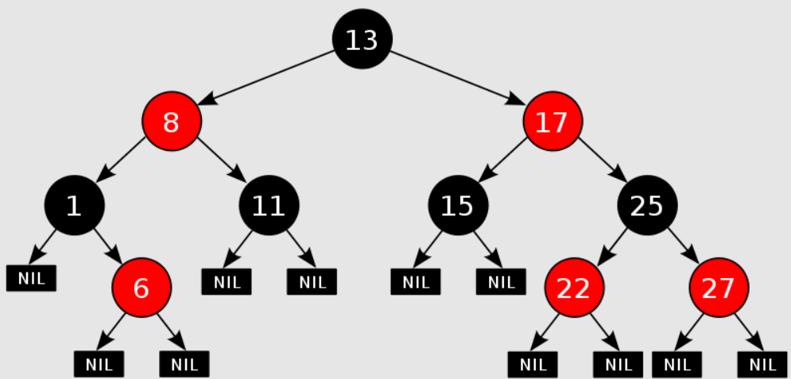
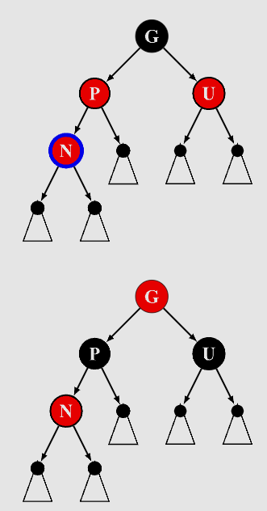
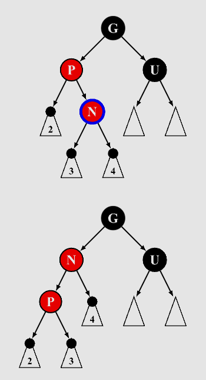
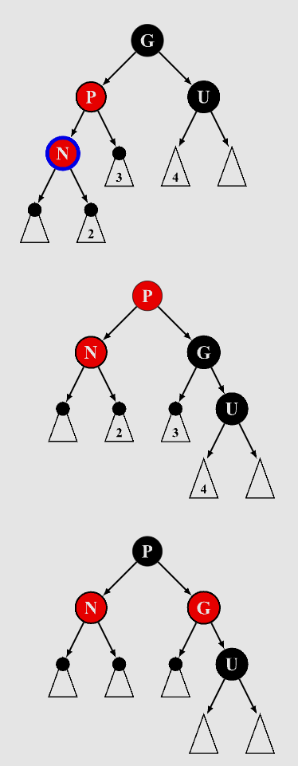
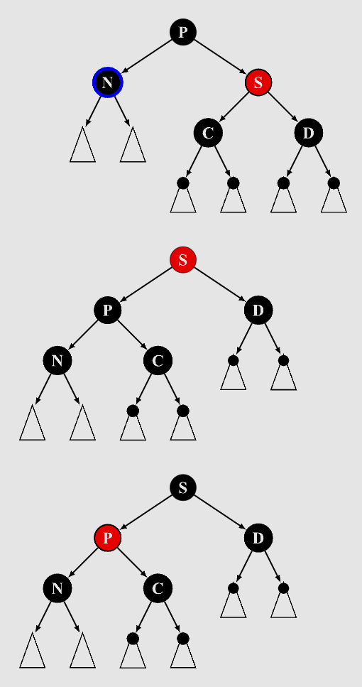
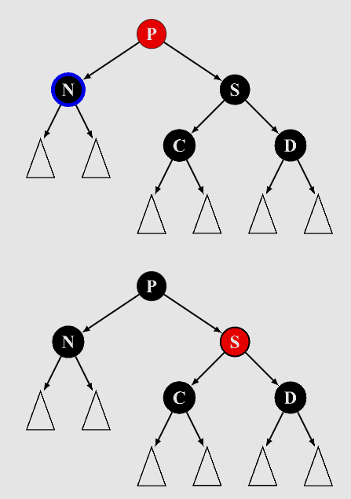
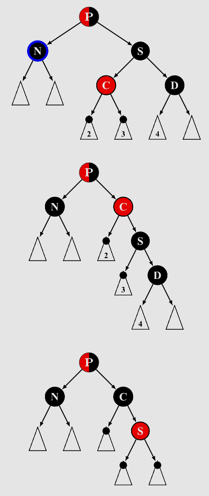
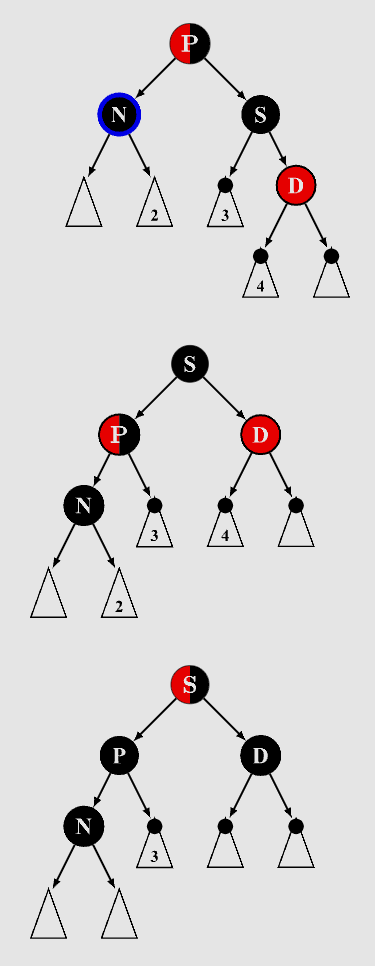
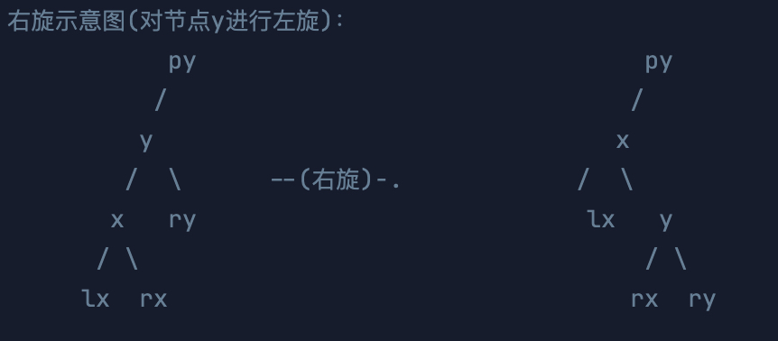
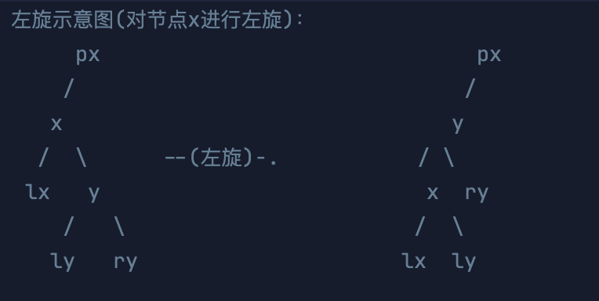

# 红黑树 RBT



# 1. 红黑树介绍

红黑树（Red-Black Tree）是一种自平衡的二叉查找树，它保证在最坏的情况下，基本动态集合操作的时间复杂度为 $O(\log n)$
。红黑树通过对节点着色，并在插入或删除节点时进行必要的调整，使树的高度始终保持在 $O(\log n)$ 以内，从而保证了高效的查找、插入和删除操作。

红黑树的广泛的应用

- JDK 1.8 开始，`HashMap` 也引入了红黑树：当冲突的链表长度超过 8 时，自动转为红黑树
- Java 中，`TreeMap`、`TreeSet` 都使用红黑树作为底层数据结构
- Linux 底层的 完全公平调度器 (CFS) 进程调度算法中，vruntime 使用红黑树进行存储。
- 多路复用技术的 `Epoll`，其核心结构是红黑树 + 双向链表。

# 2. 红黑树的定义和性质

红黑树的每个节点都包含一个颜色属性，颜色可以是红色或黑色。红黑树的定义遵循以下五个定义：

1. **每个节点要么是红色，要么是黑色**。
2. **根节点必须是黑色**。
3. **叶子节点都是黑色的空节点（NIL），即每个叶子节点都是一个特殊的黑色节点，没有存储实际数据**。
4. **如果一个节点是红色的，则它的两个子节点都必须是黑色的**。（不能有两个连续的红色节点）
5. **对每个节点，从该节点到 NIL 节点的所有路径上都包含相同数量的黑色节点**。

这些性质确保了红黑树的高度始终保持对数增长，从而使查找、插入和删除操作的时间复杂度为 $O(\log n)$。

性质：

- 从根到叶子的最长的可能路径不多于最短的可能路径的两倍长
    - 最短路径为全黑节点；最长为红黑相间，黑色首尾；
    - 最短路径 `k` 个黑节点，而最长路径是 `2k - 1`

# 3. 红黑树插入

## 3.1 插在根节点上

直接把该节点染黑（作为根节点

## 3.2 插入节点的父节点是黑色

什么都不做（节点为红色

## 3.3 插入节点的父节点是红色

### 3.3.1 叔叔节点是红色

四步做完后，需要从祖父节点继续向上递归

1. 父节点染黑
2. 叔叔节点染黑
3. 祖父节点染红
4. 祖父节点设为当前节点（红色节点，即之后对当前节点进行操作，递归向上做一样的判断，直到叔叔节点不是红色



### 3.3.2 叔叔节点是黑色，且当前节点是其父节点的右孩子

该情况无法直接处理，需要左旋后，跳转至 3.3.3

1. 将父节点作为新的当前节点
2. 以新的当前节点为支点左旋



### 3.3.3 叔叔节点是黑色，且当前节点是其父节点的左孩子

1. 父节点染黑
2. 祖父节点染红
3. 以祖父节点为支点右旋



# 4. 红黑树删除

## 4.1 删除 ”红“ + ”黑“ 节点

待删除节点有一红一黑两个子节点（NIL 为黑色也包括在内）

直接将红色的子节点染黑即可

## 4.2 删除根节点

根节点必然为黑色

直接将根节点染为黑即可

## 4.3 删除 “黑” + “黑” 节点

### 4.3.1 兄弟节点为红色

有兄弟节点，说明当前节点不是根节点，前面讨论过根节点被删除情况，后面同理。

1. 兄弟节点染黑
2. 父节点染红
3. 父节点左旋
4. 左旋后，重新设置兄弟节点为当前节点



### 4.3.2 兄弟节点为黑色，兄弟节点的两个孩子都是黑色

1. 兄弟节点染红
2. 将父节点设为新的当前节点



### 4.3.3 兄弟节点为黑色，兄弟节点左孩子红色，右孩子黑色

1. 兄弟节点左孩子染黑
2. 兄弟节点染红
3. 兄弟节点右旋
4. 右旋后，更新旋转后的 N 的兄弟节点，即从 S 变成 C



### 4.3.4 兄弟节点黑色，兄弟节点右孩子红色，左孩子任意颜色

1. 父节点颜色赋值给兄弟节点
2. 父节点染黑
3. 兄弟节点右孩子染黑
4. 父节点左旋
5. 达到平衡，当前节点设为红黑树根节点即可，不再循环，已平衡



## 删除操作总结

4.3.1 只会执行一次，变成 2/3/4 三种情况

4.3.2 每执行一次，都会向上递归，最多执行 $log(n)$ 次，递归过程可能再遇到情况一，所以 4.3.1 也是最多 $log(n)$ 次

4.3.3 执行，会变成情况四；情况四 只会执行一次

# 红黑树源码

## 一、红黑树节点定义

`RBT` 是个二叉树，同时还需要有颜色，颜色只有红黑两种情况，因此简单使用布尔值表示；

额外维护父节点 `parent`，因为插入删除需要找到兄弟或叔叔节点，需要向上遍历；

默认插入节点就是红色，原因在于：红黑树性质 5 节点到子孙节点所有路径包含相同数量黑节点，因此插入红色节点，就直接满足性质 5

```java
public class Node {
    int val;
    Node left, right, parent;
    boolean red;  // 是否为红色节点, 默认为红色(false)

    public Node(int val) {
        this.val = val;
    }
}
```

## 二、红黑树定义

```java
public class RedBlackTree {
    // 节点颜色
    public static final boolean RED = false;
    public static final boolean BLACK = true;

    public Node root;
}
```

## 三、红黑树搜索

就是普通二叉树的搜索

```java
public Node search(int val) {
    Node x = this.root;
    while (x != null) {
        if (val == x.val) return x;
        if (val < x.val) x = x.left;
        else x = x.right;
    }
    return null;
}
```

## 四、左右旋转

该版本的左右旋转是带 `parent` 节点更新的，需要注意顺序

定义 `x` 是相对于 `y` 的左侧，例如左旋，则当前节点为 `x`，右旋则当前节点是 `y`

 

以左旋为例，整体从下到上更新，这样不会丢失指针。

1. 先改 `ly.parent = x`
2. 然后将 `y` 转上去，即修改 `px` 的孩子，如果 px 为空，该树根节点就是 y；同时修改 `y.parent = px`
3. 最后更新 `y` 的孩子，`y.left = x`, `x.parent = y`；

> 3 不能在 2 之前，是因为需要通过 `x.parent` 找到老的 `px`，否则 `x.parent` 改为 `y` 后，就找不到 `px` 了

右旋就是左旋的镜像操作

```java
// 左旋
public void leftRotate(Node x) {
    Node y = x.right;
    x.right = y.left;
    if (y.left != null)
        y.left.parent = x;
    y.parent = x.parent;

    if (x.parent == null)
        this.root = y;
    else if (x == x.parent.left)
        x.parent.left = y;
    else
        x.parent.right = y;
    y.left = x;
    x.parent = y;
}

// 右旋
public void rightRotate(Node y) {
    Node x = y.left;
    y.left = x.right;
    if (x.right != null)
        x.right.parent = y;
    x.parent = y.parent;

    if (y.parent == null)
        this.root = x;
    else if (y == y.parent.left)
        y.parent.left = x;
    else
        y.parent.right = x;
    x.right = y;
    y.parent = x;
}
```

## 五、红黑树插入

<details>
<summary>红黑树插入源码</summary>

```java
// 插入节点
public void insert(int val) {
    Node z = new Node(val); // 新节点, 默认红色
    z.red = RED;
    Node y = null, x = this.root;  // y 为 z 父节点(起始为空), x 为当前节点, 遍历从 x 根节点开始
    while (x != null) {
        y = x;
        if (z.val < x.val) x = x.left;
        else x = x.right;
    }
    // x 位置为 z 待插入位置, y 是其父节点
    z.parent = y;
    if (y == null) this.root = z;  // z 插入为根节点
    else if (z.val < y.val) y.left = z;
    else y.right = z;
    // 插入后的调整
    insertFixUp(z);
}

// 插入后调整
public void insertFixUp(Node z) {
    // 插入节点的父节点为红色, 需要调整(父节点为黑色什么都不做)
    while (z.parent != null && z.parent.red == RED) {
        // z 父节点是祖父节点的左孩子
        if (z.parent == z.parent.parent.left) {
            Node uncle = z.parent.parent.right;
            // 1. 叔叔节点红色
            if (uncle != null && uncle.red == RED) {
                z.parent.red = BLACK;      // 父节点染黑
                uncle.red = BLACK;         // 叔叔节点染黑
                z.parent.parent.red = RED; // 祖父节点染红
                z = z.parent.parent;       // 祖父节点作为新节点继续调整
            } else {  // 2. 叔叔节点黑色
                if (z == z.parent.right) {  // 2.1 z 是右孩子, 需要左旋到一条直线, 在 2.2 继续处理
                    z = z.parent;           // 对父节点左旋
                    leftRotate(z);
                }
                // 2.2 叔叔节点黑色, z 是左孩子
                z.parent.red = BLACK;        // 父节点染黑
                z.parent.parent.red = RED;   // 祖父节点染红
                rightRotate(z.parent.parent);// 祖父节点右旋
            }
        } else { // z 父节点是祖父节点的右孩子(右侧即左侧的镜像操作)
            Node uncle = z.parent.parent.left;
            if (uncle != null && uncle.red == RED) {
                z.parent.red = BLACK;       // 父节点染黑
                uncle.red = BLACK;          // 叔叔节点染黑
                z.parent.parent.red = RED;  // 祖父节点染红
                z = z.parent.parent;        // 祖父节点作为新节点继续调整
            } else {
                if (z == z.parent.left) {
                    z = z.parent;           // 对父节点右旋
                    rightRotate(z);
                }
                z.parent.red = BLACK;       // 父节点染黑
                z.parent.parent.red = RED;  // 祖父节点染红
                leftRotate(z.parent.parent);// 祖父节点左旋
            }
        }
    }
    this.root.red = BLACK;  // 需要保证根节点为黑色(z 插在根节点上, 需染黑)
}
```

</details>

## 六、红黑树删除

- 先创建一些辅助方法
    - `transplant`，可以替换节点，主要用于 `delete` 节点时，将后继节点替换目标节点
    - `successor`，可以找到节点的中序遍历较大节点值，即 `successor(node)`
    - `getColor`，获取节点颜色，多封装一层 `NIL` 节点判定为黑色
    - `setColor`，设置节点颜色，判空，防止空指针

<details>
<summary>辅助方法源码</summary>

```java
// 替换节点, v 替换 u, 只替换父索引, 不替换子索引
public void transplant(Node u, Node v) {
    if (u.parent == null) this.root = v;
    else if (u == u.parent.left) u.parent.left = v;
    else u.parent.right = v;
    if (v != null) v.parent = u.parent;
}

// 寻找子树的最小节点
public Node successor(Node node) {
    node = node.right;
    while (node.left != null) {
        node = node.left;
    }
    return node;
}

// 获取节点的颜色, 若节点为 null 则默认为黑色
private boolean getColor(Node node) {
    return node == null ? BLACK : node.red;
}

// 设置节点的颜色
public void setColor(Node node, boolean color) {
    if (node != null) node.red = color;
}
```

</details>

删除后的平衡调整，`deleteFixup` 方法，入参除了待调整节点 `x`，还有其父节点 `parent`，该 `parent` 存在意义在后面解释

<details>
<summary>红黑树删除操作源码</summary>

```java
// 删除节点
public Node delete(int val) {
    Node node = search(val);        // 待删除节点
    if (node == null) return null;  // 待删除节点不存在
    Node y = node, x, parent;       // y 替换 node 节点, x 记录可能影响平衡的子树, parent 是 node 直接后续节点替换后 x 的父节点
    boolean originalColor = y.red;  // y 原始颜色
    if (node.left == null) {
        x = node.right;
        parent = node.parent;
        transplant(node, node.right);  // 右孩子替换 node
    } else if (node.right == null) {
        x = node.left;
        parent = node.parent;
        transplant(node, node.left);   // 左孩子替换 node
    } else {  // 找 node 直接后续节点, 替换 node 为 y(颜色与 node 同色)
        y = minimum(node);
        originalColor = y.red;
        x = y.right;             // y 会从右子树移除, 受影响平衡的是 y 的右子树
        if (y.parent == node) {  // y 是 node 的直接右孩子
            parent = y;          // 此时 x 可能是 null, 但 x 的父节点就是替换 node 的 y
        } else {                 // y 不是 node 的直接右孩子, y 右孩子替换 y
            parent = y.parent;
            transplant(y, y.right);
            y.right = node.right;
            y.right.parent = y;
        }
        transplant(node, y);  // y 替换 node
        y.left = node.left;
        y.left.parent = y;
        y.red = node.red;
    }
    node.left = node.right = node.parent = null;  // 清空 node 引用
    if (originalColor == BLACK) // y 从右子树移除到 node, 原来的 y 是黑色则需要调整(红色不影响性质)
        deleteFixup(x, parent);
    return node;
}

/**
 * 删除后, 从 x 向上修复
 *
 * @param x      修复起点, 可能为 null
 * @param parent x 的父节点
 */
public void deleteFixup(Node x, Node parent) {
    while (x != root && getColor(x) == BLACK) {
        if (x == parent.left) {        // x 是左孩子
            Node w = parent.right;     // w 是 x 的兄弟节点
            // 情况1：x 的兄弟节点 w 是红色
            if (getColor(w) == RED) {
                setColor(w, BLACK);      // 将 w 变成黑色
                setColor(parent, RED); // 将 x 的父节点变成红色
                leftRotate(parent);    // 对 x 的父节点左旋
                w = parent.right;      // 旋转后，更新兄弟节点 w
            }
            // 情况2：x 的兄弟节点 w 是黑色，且 w 的两个子节点都是黑色
            if (getColor(w.left) == BLACK && getColor(w.right) == BLACK) {
                setColor(w, RED); // 将 w 变成红色
                x = parent;     // 继续从父节点向上修复
                parent = x.parent;  // 更新 parent
            } else {
                // 情况3：w 是黑色，且 w 的右孩子是黑色，左孩子是红色
                if (getColor(w.right) == BLACK) {  // 上面判断过都为黑色, 只要右孩子是黑色, 左孩子就是红色
                    setColor(w.left, BLACK);       // 将 w 的左孩子变成黑色
                    setColor(w, RED);              // 将 w 变成红色
                    rightRotate(w);                // 对 w 右旋
                    w = parent.right;            // 旋转后，更新兄弟节点 w
                }
                // 情况4 可能由情况3 转化而来
                // 情况4：w 是黑色，且 w 的右孩子是红色
                setColor(w, getColor(parent)); // 将 w 设为父节点的颜色
                setColor(parent, BLACK);       // 将父节点设为黑色
                setColor(w.right, BLACK);        // 将 w 的右孩子设为黑色
                leftRotate(parent);            // 对 x 的父节点左旋
                x = root;                        // 修复完成，将 x 设为根节点
            }
        } else {
            // 如果 x 是右孩子，和左孩子的操作对称，交换左右操作即可
            Node w = parent.left;
            // 情况1：x 的兄弟节点 w 是红色
            if (getColor(w) == RED) {
                setColor(w, BLACK);
                setColor(parent, RED);
                rightRotate(parent);
                w = parent.left;
            }
            // 情况2：x 的兄弟节点 w 是黑色，且 w 的两个子节点都是黑色
            if (getColor(w.left) == BLACK && getColor(w.right) == BLACK) {
                setColor(w, RED);
                x = parent;
                parent = x.parent;
            } else {
                // 情况3：w 是黑色，且 w 的左孩子是黑色，右孩子是红色
                if (getColor(w.left) == BLACK) {
                    setColor(w.right, BLACK);
                    setColor(w, RED);
                    leftRotate(w);
                    w = parent.left;
                }
                // 情况4：w 是黑色，且 w 的左孩子是红色
                setColor(w, getColor(parent));
                setColor(parent, BLACK);
                setColor(w.left, BLACK);
                rightRotate(parent);
                x = root;
            }
        }
    }
    setColor(x, BLACK); // 将最终的 x 设为黑色
}
```

</details>

## 七、测试代码

<details>
<summary>验证红黑树是否符合性质</summary>

```java
public boolean verifyRBTProperties() {
    return verifyProperty1(root) && verifyProperty2(root) &&
            verifyProperty4(root) && verifyProperty5(root) && verifyProperty6(root);
}

// 红黑树的性质1：每个节点是红色或黑色
private boolean verifyProperty1(Node node) {
    if (node == null) return true;  // null 节点视为黑色
    return (node.red || !node.red) && verifyProperty1(node.left) && verifyProperty1(node.right);
}

// 红黑树的性质2：根节点是黑色
private boolean verifyProperty2(Node root) {
    return root == null || root.red == BLACK;
}

// 红黑树的性质3：每个叶子节点都是黑色的空节点 null(不用验证)

// 红黑树的性质4：每个红色节点的两个子节点都是黑色
private boolean verifyProperty4(Node node) {
    if (node == null) return true;
    if (node.red == RED) {
        if (node.left != null && node.left.red == RED) return false;
        if (node.right != null && node.right.red == RED) return false;
    }
    return verifyProperty4(node.left) && verifyProperty4(node.right);
}

// 红黑树的性质5：从任一节点到其每个叶子节点的路径都包含相同数目的黑色节点
private boolean verifyProperty5(Node node) {
    return blackHeight(node) != -1;
}

// 验证是否为二叉搜索树, 中序遍历结果递增
public boolean verifyProperty6(Node root) {
    List<Integer> values = new ArrayList<>();
    inOrderTraversal(root, values);
    for (int i = 1; i < values.size(); i++) {
        if (values.get(i) < values.get(i - 1)) {
            System.out.println("Inorder traversal is not increasing: " + values);
            return false;
        }
    }
    return true;
}

// 中序遍历，将节点值添加到列表中
private void inOrderTraversal(Node node, List<Integer> values) {
    if (node == null) {
        return;
    }
    inOrderTraversal(node.left, values);
    values.add(node.val);
    inOrderTraversal(node.right, values);
}

// 计算黑高，如果黑高不一致则返回-1，代表红黑树不合法
private int blackHeight(Node node) {
    if (node == null) return 1;  // null 节点作为黑节点
    int leftBlackHeight = blackHeight(node.left);
    int rightBlackHeight = blackHeight(node.right);
    if (leftBlackHeight == -1 || rightBlackHeight == -1 || leftBlackHeight != rightBlackHeight)
        return -1;
    return leftBlackHeight + (node.red == RED ? 0 : 1);  // 红节点不计入黑高
}
```

</details>


<details>
<summary>打印红黑树</summary>

```java
public void printTree(Node root) {
    if (root == null) return;
    LinkedList<Node> queue = new LinkedList<>();
    queue.add(root);
    while (!queue.isEmpty()) {
        int size = queue.size();
        for (int i = 0; i < size; i++) {
            Node n = queue.poll();
            String pos = n.parent == null ? "" : (n == n.parent.left ? " LE" : " RI");
            String pstr = n.parent == null ? "" : n.parent.val + "";
            String cstr = n.red == RED ? "R" : "B";
            cstr = n.parent == null ? cstr : cstr + " ";
            System.out.print(n.val + "(" + (cstr) + pstr + (pos) + ")" + "\t");
            if (n.left != null) queue.add(n.left);
            if (n.right != null) queue.add(n.right);
        }
        System.out.println();
    }
}
```

</details>

<details>
<summary>主函数</summary>

```java
public class Solution {
    public static void main(String[] args) {
        /**
         * 红黑树插入验证
         */
        RedBlackTree tree = new RedBlackTree();
        int[] valuesToInsert = getRamdomIntArray(100);
        System.out.println("插入操作：");
        for (int value : valuesToInsert) {
            tree.insert(value);
            System.out.println("插入 " + value + " 后的树结构：");
            tree.printTree(tree.root);
            System.out.println("验证插入后的树结构是否满足红黑树性质：" + tree.verifyRBTProperties());
            System.out.println("\n-------------------------");
        }

        /**
         * 红黑树删除验证
         */
        RedBlackTree tree2 = new RedBlackTree();
        for (int value : valuesToInsert) {
            tree2.insert(value);
        }
        System.out.println("删除操作：");
        int[] valuesToDelete = getRamdomIntArray(50);
        for (int value : valuesToDelete) {
            tree2.delete(value);
            System.out.println("删除 " + value + " 后的树结构：");
            tree2.printTree(tree2.root);
            System.out.println("验证删除后的树结构是否满足红黑树性质：" + tree2.verifyRBTProperties());
            System.out.println("\n-------------------------");
        }
    }

    // 生成随机指定长度随机 int 数组
    private static int[] getRamdomIntArray(int size) {
        Random random = new Random();
        int[] arr = new int[size];
        for (int i = 0; i < size; i++) {
            arr[i] = random.nextInt(1000) + 1;
        }
        System.out.print("arr: {");
        for (int i = 0; i < size; i++) {
            System.out.print(arr[i]);
            if (i < size - 1)
                System.out.print(", ");
        }
        System.out.println("}");
        return arr;
    }
}
```

</details>

## 删除操作补充说明

### 双黑 null 节点无法平衡问题

下面删除操作，在左右孩子都不空的条件下，后继节点 `y` 会替换 `node`，而 `y` 的右孩子会替换 `y`；

如果 `y` 是 `node` 的直接右孩子，且 `y` 的右孩子是 `null`，在删除后的调整后，`deleteFixup` 的入参 `x` 是 `null`，一方面会影响到
`x` 找到兄弟节点（空指针异常），另一方面 `x` 作为 `null`，失去 `parent` 的引用，双黑节点无法向上平衡调整。

<details>
<summary>双黑 null 节点无法平衡问题源码</summary>

```java
// 删除节点
public Node delete(int val) {
    Node node = search(val);        // 待删除节点
    if (node == null) return null;  // 待删除节点不存在
    Node y = node, x;  // y 替换 node 节点, x 记录可能影响平衡的子树
    boolean originalColor = y.red;  // y 原始颜色
    if (node.left == null) {
        x = node.right;
        transplant(node, node.right);  // 右孩子替换 node
    } else if (node.right == null) {
        x = node.left;
        transplant(node, node.left);   // 左孩子替换 node
    } else {
        y = successor(node);
        originalColor = y.red;
        x = y.right;
        if (y.parent == node) {  // y 是 node 的直接右孩子
            if (x != null) x.parent = y;
        }
        // y 是 node 直接右孩子, 不需要处理右侧逻辑
        if (y.parent != node) {    // y 不是 node 的直接右孩子
            // y 右孩子替换 y
            transplant(y, y.right);
            y.right = node.right;
            y.right.parent = y;
        }
        transplant(node, y);  // y 替换 node
        y.left = node.left;
        y.left.parent = y;
        y.red = node.red;
    }
    if (originalColor == BLACK) // y 是黑色, 从下面替换到上面的 node, 需要调整(红色不影响性质)
        deleteFixup(x);
    return node;
}

// 删除后调整
public void deleteFixup(Node x) {
    while (x != root && getColor(x) == BLACK) {
        if (x == x.parent.left) {        // x 是左孩子
            Node w = x.parent.right;     // w 是 x 的兄弟节点
            // 情况1：x 的兄弟节点 w 是红色
            if (getColor(w) == RED) {
                setColor(w, BLACK);      // 将 w 变成黑色
                setColor(x.parent, RED); // 将 x 的父节点变成红色
                leftRotate(x.parent);    // 对 x 的父节点左旋
                w = x.parent.right;      // 旋转后，更新兄弟节点 w
            }
            // 情况2：x 的兄弟节点 w 是黑色，且 w 的两个子节点都是黑色
            if (getColor(w.left) == BLACK && getColor(w.right) == BLACK) {
                setColor(w, RED); // 将 w 变成红色
                x = x.parent;     // 继续从父节点向上修复
            } else {
                // 情况3：w 是黑色，且 w 的右孩子是黑色，左孩子是红色
                if (getColor(w.right) == BLACK) {  // 上面判断过都为黑色, 只要右孩子是黑色, 左孩子就是红色
                    setColor(w.left, BLACK);       // 将 w 的左孩子变成黑色
                    setColor(w, RED);              // 将 w 变成红色
                    rightRotate(w);                // 对 w 右旋
                    w = x.parent.right;            // 旋转后，更新兄弟节点 w
                }
                // 情况4 可能由情况3 转化而来
                // 情况4：w 是黑色，且 w 的右孩子是红色
                setColor(w, getColor(x.parent)); // 将 w 设为父节点的颜色
                setColor(x.parent, BLACK);       // 将父节点设为黑色
                setColor(w.right, BLACK);        // 将 w 的右孩子设为黑色
                leftRotate(x.parent);            // 对 x 的父节点左旋
                x = root;                        // 修复完成，将 x 设为根节点
            }
        } else {
            // 如果 x 是右孩子，和左孩子的操作对称，交换左右操作即可
            Node w = x.parent.left;
            // 情况1：x 的兄弟节点 w 是红色
            if (getColor(w) == RED) {
                setColor(w, BLACK);
                setColor(x.parent, RED);
                rightRotate(x.parent);
                w = x.parent.left;
            }
            // 情况2：x 的兄弟节点 w 是黑色，且 w 的两个子节点都是黑色
            if (getColor(w.left) == BLACK && getColor(w.right) == BLACK) {
                setColor(w, RED);
                x = x.parent;
            } else {
                // 情况3：w 是黑色，且 w 的左孩子是黑色，右孩子是红色
                if (getColor(w.left) == BLACK) {
                    setColor(w.right, BLACK);
                    setColor(w, RED);
                    leftRotate(w);
                    w = x.parent.left;
                }
                // 情况4：w 是黑色，且 w 的左孩子是红色
                setColor(w, getColor(x.parent));
                setColor(x.parent, BLACK);
                setColor(w.left, BLACK);
                rightRotate(x.parent);
                x = root;
            }
        }
    }
    setColor(x, BLACK); // 将最终的 x 设为黑色
}
```

</details>

用以下 case 可以测出空指针问题

```java
int[] valuesToInsert = {10, 20, 30, 15, 25, 5, 1};
int[] valuesToDelete = {30, 20, 10};
```

> 删除 30 后的树结构：
> 20(B)
> 10(R 20 LE)    25(B 20 RI)
> 5(B 10 LE)    15(B 10 RI)
> 1(R 5 LE)

删除 20 时，直接后继是 25，25 替换 20 后，没办法让 25 的右子树 `x` 替换 25，因为 `x` 是 `null`，无法指定 `parent`，且后续还需要针对
`x` 进行平衡操作，因此 `x` 作为双黑节点无法找到父节点和兄弟节点而无法平衡操作

### 解决双黑 null 节点平衡问题

相较于有问题的版本，给 `deleteFixup` 额外添加一个 `parent` 参数，用来表示 `x` 的父引用，这样即使在调整双黑 `null`
节点，也能顺利找到父节点和兄弟节点。

除此之外，`deleteFixup` 还需要额外添加 `parent` 的更新，例如情况 2，`x` 向 `parent` 移动，`parent` 引用也需要更新

<details>
<summary>解决双黑 null 节点平衡问题源码</summary>

```java
// 删除节点
public Node delete(int val) {
    Node node = search(val);        // 待删除节点
    if (node == null) return null;  // 待删除节点不存在
    Node y = node, x, parent;       // y 替换 node 节点, x 记录可能影响平衡的子树, parent 是 node 直接后续节点替换后 x 的父节点
    boolean originalColor = y.red;  // y 原始颜色
    if (node.left == null) {
        x = node.right;
        parent = node.parent;
        transplant(node, node.right);  // 右孩子替换 node
    } else if (node.right == null) {
        x = node.left;
        parent = node.parent;
        transplant(node, node.left);   // 左孩子替换 node
    } else {  // 找 node 直接后续节点, 替换 node 为 y(颜色与 node 同色)
        y = successor(node);
        originalColor = y.red;
        x = y.right;             // y 会从右子树移除, 受影响平衡的是 y 的右子树
        if (y.parent == node) {  // y 是 node 的直接右孩子
            parent = y;          // 此时 x 可能是 null, 但 x 的父节点就是替换 node 的 y
        } else {                 // y 不是 node 的直接右孩子, y 右孩子替换 y
            parent = y.parent;
            transplant(y, y.right);
            y.right = node.right;
            y.right.parent = y;
        }
        transplant(node, y);  // y 替换 node
        y.left = node.left;
        y.left.parent = y;
        y.red = node.red;
    }
    node.left = node.right = node.parent = null;  // 清空 node 引用
    if (originalColor == BLACK) // y 从右子树移除到 node, 原来的 y 是黑色则需要调整(红色不影响性质)
        deleteFixup(x, parent);
    return node;
}

/**
 * 删除后, 从 x 向上修复
 *
 * @param x      修复起点, 可能为 null
 * @param parent x 的父节点
 */
public void deleteFixup(Node x, Node parent) {
    while (x != root && getColor(x) == BLACK) {
        if (x == parent.left) {        // x 是左孩子
            Node w = parent.right;     // w 是 x 的兄弟节点
            // 情况1：x 的兄弟节点 w 是红色
            if (getColor(w) == RED) {
                setColor(w, BLACK);      // 将 w 变成黑色
                setColor(parent, RED); // 将 x 的父节点变成红色
                leftRotate(parent);    // 对 x 的父节点左旋
                w = parent.right;      // 旋转后，更新兄弟节点 w
            }
            // 情况2：x 的兄弟节点 w 是黑色，且 w 的两个子节点都是黑色
            if (getColor(w.left) == BLACK && getColor(w.right) == BLACK) {
                setColor(w, RED); // 将 w 变成红色
                x = parent;     // 继续从父节点向上修复
                parent = x.parent;  // 更新 parent
            } else {
                // 情况3：w 是黑色，且 w 的右孩子是黑色，左孩子是红色
                if (getColor(w.right) == BLACK) {  // 上面判断过都为黑色, 只要右孩子是黑色, 左孩子就是红色
                    setColor(w.left, BLACK);       // 将 w 的左孩子变成黑色
                    setColor(w, RED);              // 将 w 变成红色
                    rightRotate(w);                // 对 w 右旋
                    w = parent.right;            // 旋转后，更新兄弟节点 w
                }
                // 情况4 可能由情况3 转化而来
                // 情况4：w 是黑色，且 w 的右孩子是红色
                setColor(w, getColor(parent)); // 将 w 设为父节点的颜色
                setColor(parent, BLACK);       // 将父节点设为黑色
                setColor(w.right, BLACK);        // 将 w 的右孩子设为黑色
                leftRotate(parent);            // 对 x 的父节点左旋
                x = root;                        // 修复完成，将 x 设为根节点
            }
        } else {
            // 如果 x 是右孩子，和左孩子的操作对称，交换左右操作即可
            Node w = parent.left;
            // 情况1：x 的兄弟节点 w 是红色
            if (getColor(w) == RED) {
                setColor(w, BLACK);
                setColor(parent, RED);
                rightRotate(parent);
                w = parent.left;
            }
            // 情况2：x 的兄弟节点 w 是黑色，且 w 的两个子节点都是黑色
            if (getColor(w.left) == BLACK && getColor(w.right) == BLACK) {
                setColor(w, RED);
                x = parent;
                parent = x.parent;
            } else {
                // 情况3：w 是黑色，且 w 的左孩子是黑色，右孩子是红色
                if (getColor(w.left) == BLACK) {
                    setColor(w.right, BLACK);
                    setColor(w, RED);
                    leftRotate(w);
                    w = parent.left;
                }
                // 情况4：w 是黑色，且 w 的左孩子是红色
                setColor(w, getColor(parent));
                setColor(parent, BLACK);
                setColor(w.left, BLACK);
                rightRotate(parent);
                x = root;
            }
        }
    }
    setColor(x, BLACK); // 将最终的 x 设为黑色
}
```

</details>

当然，也可以增加一个哨兵节点 `NIL = new Node()` ，不让叶子结点为 `null`，从而可以保存父引用，代码需要将所有的 `null` 判断全部改成
`NIL` 引用的判断，但是也增加了插入操作的复杂性。

### JDK TreeMap 实现删除操作

参考 JDK 21 里的 `java.util.TreeMap#deleteEntry` 删除红黑树节点操作

TreeMap 删除操作：

1. 待删除节点 `p`，如果左右孩子都存在，则找直接后继节点 `s`，`s` 值替换 `p`，然后 `p` 下移到 `s`
2. `replacement` 是 `p` 的左右非空子节点（左子树优先），`p` 可能是待删除节点，也可能是值替换后下移的后继节点 `s`。而后续的操作都是针对
   `replacement` 删除，再调整平衡。该后续操作无论针对删除原节点 `p`，还是已经值替换到上面 `p` 的后继节点 `s`（`s` 替换 `p` 后
   `s`  从 `p` 右子树移除），这一删除都是成立的。
3. `replacement` 不空，则代表 `replacement` 可以直接替换 `p`。注意，此时 `replacement` 是 `p` 的左右孩子其一，且非空，而 `p`
   的另一个孩子必然为空。
    1. 解释：如果 `p` 有两个非空孩子，则其会在一开始就会进入第一个 `if`，找到后继节点并值替换。然而找到的后继节点 `s`
       左孩子必然是空的（否则会继续向左孩子遍历），只有可能有非空右孩子。而 `p` 一开始就没有两个非空孩子，则至多只有一个非空孩子，保证
       `replacement` 取到一个非空孩子并进入 `if (replacement != null)` 块中
    2. 论证 `p` 有且仅有一个孩子 `replacement` 非空（左右不重要），就可以直接将 `replacement` 替换 `p`，且只需要修改
       `replacement` 父引用和 `p.parent` 子引用，不需要考虑 `replacement` 的另一个兄弟（`null`），直接简化了删除操作，变成一个单一链路的替换，而不考虑
       `p` 可能同时被两个孩子替代
4. 下面都是 `p` 无孩子情况
    - 替换的 `p` 是根节点，直接将 `root` 置空（`null` 替换根节点）
    - `p` 非父节点，注释中提到用 `p` 作为幻影替换自身，即什么都不做，先进行删除后的平衡，然后将父节点的子引用调节为 `null`
      ，实现 `p` 被替换的同时，也能平衡红黑树

<details>
<summary>TreeMap 删除操作源码</summary>

```java
// 删除节点
public void delete(int val) {
    Node p = search(val);        // 待删除节点
    if (p == null) return;       // 待删除节点不存在

    if (p.left != null && p.right != null) {
        Node s = successor(p);
        p.val = s.val;
        p = s;
    } // p has 2 children

    // Start fixup at replacement node, if it exists.
    Node replacement = (p.left != null ? p.left : p.right);

    if (replacement != null) {
        // Link replacement to parent
        replacement.parent = p.parent;
        if (p.parent == null)
            root = replacement;
        else if (p == p.parent.left)
            p.parent.left = replacement;
        else
            p.parent.right = replacement;

        // Null out links so they are OK to use by fixAfterDeletion.
        p.left = p.right = p.parent = null;

        // Fix replacement
        if (p.red == BLACK)
            deleteFixup(replacement);
    } else if (p.parent == null) { // return if we are the only node.
        root = null;
    } else { //  No children. Use self as phantom replacement and unlink.
        if (p.red == BLACK)
            deleteFixup(p);

        if (p.parent != null) {
            if (p == p.parent.left)
                p.parent.left = null;
            else if (p == p.parent.right)
                p.parent.right = null;
            p.parent = null;
        }
    }
}

// 删除后调整
public void deleteFixup(Node x) {
    while (x != root && getColor(x) == BLACK) {
        if (x == x.parent.left) {        // x 是左孩子
            Node w = x.parent.right;     // w 是 x 的兄弟节点
            // 情况1：x 的兄弟节点 w 是红色
            if (getColor(w) == RED) {
                setColor(w, BLACK);      // 将 w 变成黑色
                setColor(x.parent, RED); // 将 x 的父节点变成红色
                leftRotate(x.parent);    // 对 x 的父节点左旋
                w = x.parent.right;      // 旋转后，更新兄弟节点 w
            }
            // 情况2：x 的兄弟节点 w 是黑色，且 w 的两个子节点都是黑色
            if (getColor(w.left) == BLACK && getColor(w.right) == BLACK) {
                setColor(w, RED); // 将 w 变成红色
                x = x.parent;     // 继续从父节点向上修复
            } else {
                // 情况3：w 是黑色，且 w 的右孩子是黑色，左孩子是红色
                if (getColor(w.right) == BLACK) {  // 上面判断过都为黑色, 只要右孩子是黑色, 左孩子就是红色
                    setColor(w.left, BLACK);       // 将 w 的左孩子变成黑色
                    setColor(w, RED);              // 将 w 变成红色
                    rightRotate(w);                // 对 w 右旋
                    w = x.parent.right;            // 旋转后，更新兄弟节点 w
                }
                // 情况4 可能由情况3 转化而来
                // 情况4：w 是黑色，且 w 的右孩子是红色
                setColor(w, getColor(x.parent)); // 将 w 设为父节点的颜色
                setColor(x.parent, BLACK);       // 将父节点设为黑色
                setColor(w.right, BLACK);        // 将 w 的右孩子设为黑色
                leftRotate(x.parent);            // 对 x 的父节点左旋
                x = root;                        // 修复完成，将 x 设为根节点
            }
        } else {
            // 如果 x 是右孩子，和左孩子的操作对称，交换左右操作即可
            Node w = x.parent.left;
            // 情况1：x 的兄弟节点 w 是红色
            if (getColor(w) == RED) {
                setColor(w, BLACK);
                setColor(x.parent, RED);
                rightRotate(x.parent);
                w = x.parent.left;
            }
            // 情况2：x 的兄弟节点 w 是黑色，且 w 的两个子节点都是黑色
            if (getColor(w.left) == BLACK && getColor(w.right) == BLACK) {
                setColor(w, RED);
                x = x.parent;
            } else {
                // 情况3：w 是黑色，且 w 的左孩子是黑色，右孩子是红色
                if (getColor(w.left) == BLACK) {
                    setColor(w.right, BLACK);
                    setColor(w, RED);
                    leftRotate(w);
                    w = x.parent.left;
                }
                // 情况4：w 是黑色，且 w 的左孩子是红色
                setColor(w, getColor(x.parent));
                setColor(x.parent, BLACK);
                setColor(w.left, BLACK);
                rightRotate(x.parent);
                x = root;
            }
        }
    }
    setColor(x, BLACK); // 将最终的 x 设为黑色
}
```

</details>

总结 `TreeMap` 删除操作精妙之处：

1. `BST` 的删除可能删除原节点 `p`，也可能删除后继节点 `s`（`p` 被 `s` 替换，`s` 需要从 `p` 的右子树删除）。方法开始就处理 `p`
   有两孩的情况，下面的后继 `s` 值替换后，`p` 会下移至 `s` ，p 就变成**单孩**或**无孩**
2. 接下来才进行真正的引用替换，只需要进行简单的两节点（`p.parent`, `replacement` ）修改引用即可，而不涉及两孩争抢 `p` 的问题

# Reference

- https://www.bilibili.com/video/BV1Ar4y1Q7Js
- https://oi-wiki.org/ds/rbtree
- https://tech.meituan.com/2016/12/02/redblack-tree.html
- https://jingyuexing.github.io/Ebook/Algorithm/算法导论.pdf
    - 《算法导论》第二版在线版，第 13 章 红黑树

源码实现大部分参照《算法导论》：

- https://www.cnblogs.com/skywang12345/p/3245399.html
- https://www.cnblogs.com/skywang12345/p/3624343.html
- Java JDK TreeMap - https://github.com/openjdk/jdk/blob/master/src/java.base/share/classes/java/util/TreeMap.java

非常详细的红黑树删除演示：

- https://www.bilibili.com/video/BV16m421u7Tb